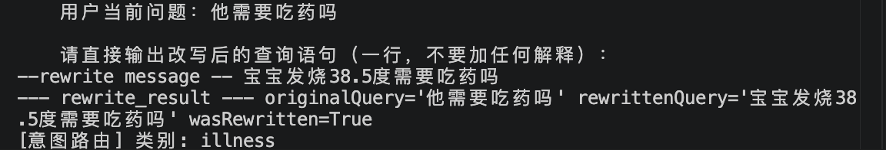
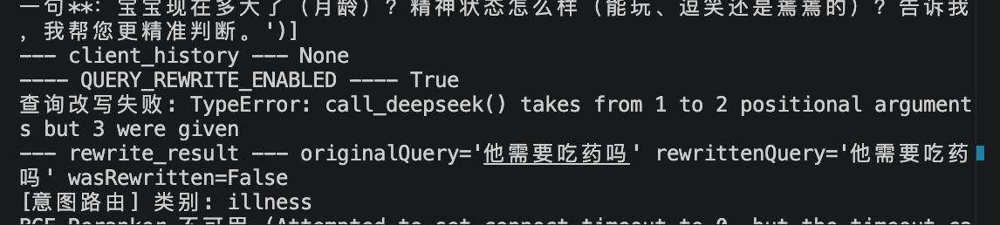
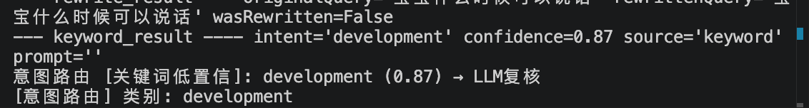
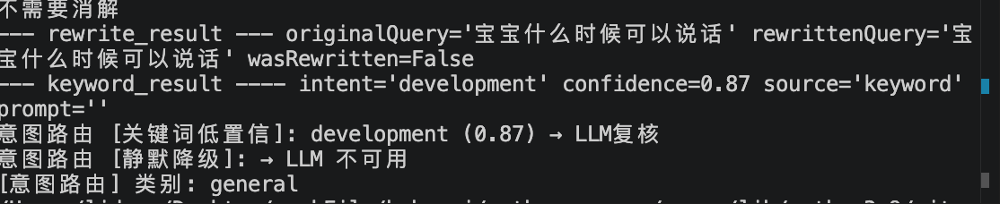
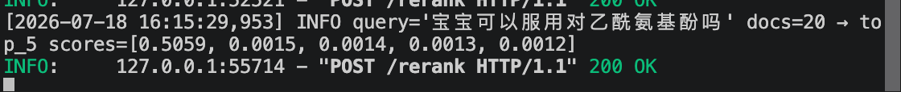
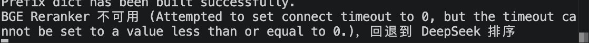
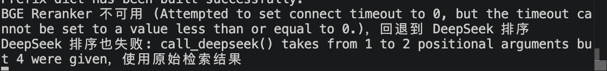

# 降级策略验证记录

> 📅 验证日期：2026-07-18

## 验证结果

| # | 环节 | 触发方式 | 预期行为 | 实际结果 | 状态 |
|---|------|---------|---------|---------|:---:|
| 1 | Query Rewrite | API Key 改错 | 退回原始 query | 打印降级日志，query 保持原样 | ✅ |
| 2 | 意图路由 | LLM timeout 改极小 | 降级为 general | 打印降级日志，使用general默认值 | ✅ |
| 3 | Rerank → DeepSeek | 停掉 Reranker 服务 | 自动切 LLM 打分 | 打印降级日志，Deepseek排序 | ✅ |
| 4 | Rerank → 兜底 | 停 Reranker + API Key 改错 | 返回原始向量结果 | 打印降级日志，使用原始向量结果 | ✅ |

## 测试用 query

### 1. Query Rewrite
固定用一个多轮对话场景来测，保证每次输入一致：

1. 先问"宝宝发烧38.5度怎么办"
2. 追问"他需要吃药吗"（触发指代消解 → 验证 Query Rewrite 降级）

- 正常的回答内容： 

- 失败的内容: 

### 2. 意图路由

固定用一个多轮对话场景来测，保证每次输入一致：

1. 问"宝宝什么时候可以说话"

- 低置信度 <= 0.9 LLM复核：

- 异常兜底：


### 3. Rerank

固定用一个多轮对话场景来测，保证每次输入一致：

1. 问"宝宝可以服用对乙酰氨基酚吗"

- Rerank 排序：

- LLM 兜底：

    - 修改方式（在开发环境临时修改 timeout=0 构造超时，验证完成后恢复原值。）：
    ```
        response = requests.post(
                url=RERANKER_URL,
                json={
                    "query": query,
                    "documents": [{"id": d.id, "text": d.text} for d in docs],
                    "top_k": top_k,
                },
                timeout=0,
            )
    ```
    - 

- 异常兜底：
    - 修改方式（在开发环境临时修改 timeout=0 构造超时，验证完成后恢复原值。）：
    ```
    messages = [ChatMessage(
        role="user",
        content=f"从下列文档中选出与查询最相关的 {top_k} 条，每行输出一个编号（只输出数字）：\n\n查询：{query}\n\n{doc_list_text}",
    )]
    options = ChatOptions(temperature=0, maxTokens=50)
    content = call_deepseek(messages, options, 1, 1)
    ```
    - 

## 备注

- 每项测完填"实际结果"列，截一张终端日志存到同目录 screenshot/ 下
- 全部通过后把 ⬜ 改成 ✅
