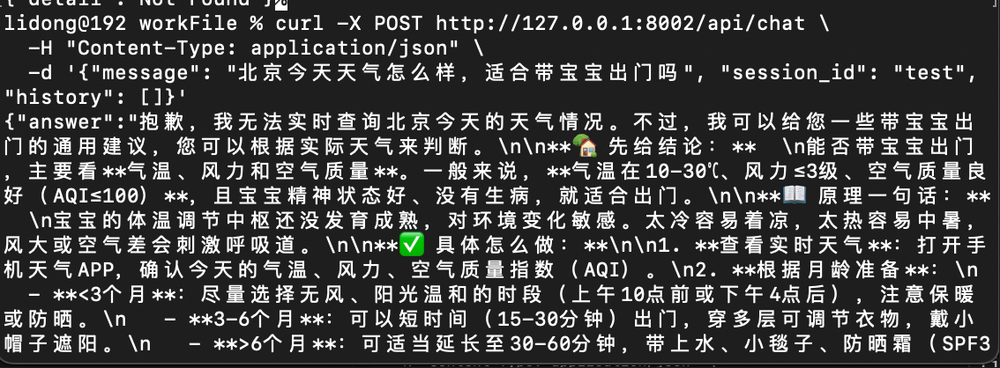
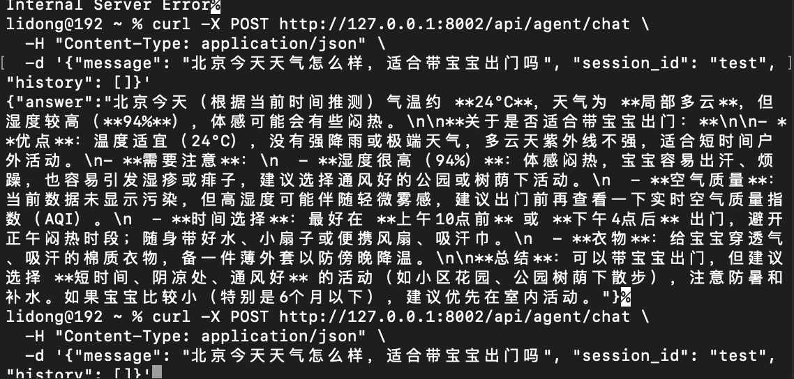

# FunctionCalling基础

> 📅 学习日期：2026-07-21
> 🔗 关联面试题：Agent 专题 题8（Agent 定义及与传统 AI 区别）、题9（LLM Agent 架构组成）、题11（Agent 核心工作流程）、题18（Agent 与直接调用 LLM API 的本质区别）、题19（Tool Calling 完整链路解析）

## 一、Agent 基础

### 定义

> 🧠 概念层：Agent 是什么

**通俗理解：**Agent 是具备自主思考、工具调用、任务拆解、多轮迭代能力的大模型智能体。

Agent 是一个可以自主感知环境、进行思考推理，并调用工具执行任务以实现特定目标的计算系统。

Agent 核心五要素：感知（Perception）、规划（Planning）、记忆（Memory）、行动（Action）、反思（Reflection）。

> 🔧 工程层：Agent 怎么搭

**经典公式：** Agent = LLM + Memory + Tools + Planning + Action

Agent架构由 LLM（大脑）、Memory（经验库）、Tools（手脚） 三块基础设施构成，并通过 Planning（拆解目标） 和 Action（执行落地） 的闭环迭代串联；其中Memory为Planning提供上下文，Action的反馈又实时回流更新Memory。

Agent 分为两部分：

1. 基础能力组：LLM（大脑）、Memory（经验/记忆库）、Tools（工具）

2. 循环执行组：Planning -》Action -》基础能力组 -》反思-》继续这个前面的步骤，直到完成任务为止。

> 基础能力组提供"弹药"（记忆中的历史上下文 + 可调用的工具列表），循环执行组负责"打仗"（拆任务→调工具→看结果→反思→再规划），直到任务完成。

> 🔄 行为层：Agent 怎么跑

Agent 执行时的核心闭环：**感知输入 → 规划步骤 → 调用工具 → 观察结果 → 反思调整 → 继续循环**，直到任务完成。这就是 ReAct（Reasoning + Acting）模式的本质。

### Agent 运行模式

常见的Agent运行模式：

1. Single Agent（单智能体）：一个Agent独立运行，通过不断调用工具和反思完成任务（ReAct模式：思考→行动→观察→反思→再思考 的循环）

2. Multi Agent（多智能体）：多个智能体分工互相对话、协作、甚至对抗，共同完成极其复杂的工程任务（如MetaGPT，ChatDev）

### Agent 与传统软件、大模型（LLM）的区别
| 特性 | 传统软件 (Software) | 大模型 (LLM) | 智能体 (Agent) |
|------|-------------------|-------------|--------------|
| 驱动方式 | 严格硬编码逻辑（If-Else） | 概率预测与文本生成 | 目标驱动与自主规划 |
| 灵活性 | 极低（超出规则就报错） | 中等（能理解并生成，但无行动力） | 极高（能自主摸索解决路径） |
| 工具使用 | 只能使用自带功能 | 无法直接使用外部工具 | 能自主决定何时调用何种工具 |
| 角色比喻 | 按说明书组装零件的机器 | 知识渊博但没有手脚的军师 | 能独立完成项目的专业员工 |

### 面试怎么讲

> "Agent 本质上是一个能自主思考、会用工具、能拆任务的大模型应用。从概念层看有五个要素——感知、规划、记忆、行动、反思；从工程层看就是 Agent = LLM + Memory + Tools + Planning + Action，少了反思是因为目前大多数框架的反思机制还比较弱。
>
> 架构上我习惯分成两组来理解：基础能力组（LLM + Memory + Tools）是静态资源，提供大脑、记忆和手脚；循环执行组（Planning → Action → Observation → Reflection）是动态流程，负责拆任务、调工具、看结果、反思再迭代，直到任务完成。
>
> 运行模式分单智能体和多智能体。单智能体本质上是 ReAct 模式的工程化落地——思考、行动、观察、再思考的循环；多智能体是多个单智能体分工协作，适合复杂的长链任务。
>
> 我目前在 baby-ai 里用的是单 Agent 架构，核心是 Function Calling 驱动工具调用，配合对话历史管理实现多轮迭代。后续计划引入 ReAct 循环和多 Agent 协作。"


## 二、FunctionCalling 基础

### 概念

**定义**：Function Calling 是指 LLM 在收到用户提问后，不直接输出文本答案，而是基于语义理解自主决策——输出一个结构化的 JSON 调用指令，告诉外部系统去执行哪个函数、传什么参数。

Function Call：基于LLM的语言理解能力，通过理解语义，自主决策使用某项工具，并结构化调用。


**职责分界**：
- **LLM 侧（意图翻译官）**：根据语义将用户需求转化为结构化的函数指令（JSON）
- **后端侧（工具调度员）**：解析指令、路由至对应函数执行、将结果（Observation）回填给 LLM，完成推理闭环

> 💡 **Schema ≠ Function Calling**：配置文件（Schema）是提前定义好的”死”字典，描述有哪些工具、各需要什么参数；Function Calling 是 LLM 依据 Schema 进行实时语义理解后、自主决策输出的”活”的调用指令。Schema 是菜单，Function Calling 是点菜。

Function Calling 的本质：LLM 不是"找到模板填空"，而是基于语义理解自主决策——判断是否需要调工具、选哪个工具、从用户话里提取或推理出参数值。


### 为什么 Agent 需要 Function Calling？

LLM 擅长推理和生成，但本身存在两大天然局限:

1. 信息滞后，训练数据有截止日期，无法获取实时信息。

2. 无法操作外部系统：LLM只能输出文本，无法直接发邮件、查数据库或控制硬件。

它将自然语言意图转化为结构化的API调用指令，让LLM更安全、精准地驱动Tools

### 核心工作流程

| 步骤 | 角色 | 动作 | 数据流向 |
|:---:|------|------|:---:|
| ① 注册工具 | 开发者 | 将外部函数（如 get_weather）按 OpenAI/Anthropic 规范的 JSON Schema 格式，注册到 LLM 请求参数中 | Tools → LLM |
| ② 意图识别 | LLM | 根据用户输入判断是否需要调用工具，若需要则输出标准化的 tool_calls 结构体而非文本回答 | LLM → 编排器 |
| ③ 本地执行 | 编排器 | 解析 tool_calls，安全调用本地/远程对应函数，获取 Observation | 编排器 → Tools |
| ④ 结果回传 | 编排器 | 将 Observation 以 tool_message 角色追加到 Memory 中，再次发给 LLM 进行反思或生成最终回答 | Memory → LLM |


###  Function Calling 的使用方式

1. tools参数定义

```json

{
    "type": "function",
    "function": {
        "name": "get_weather",
        "strict": true,
        "description": "Get weather of a location, the user should supply a location first.",
        "parameters": {
            "type": "object",
            "properties": {
                "location": {
                    "type": "string",
                    "description": "The city and state, e.g. San Francisco, CA",
                }
            },
            "required": ["location"],
            "additionalProperties": false
        }
    }
}

```

**parameters** 中包含了 object、string、number、integer、boolean、array、enum、anyOf。**parameters**需要遵循的就是JSON Schema格式。


**Object**
object 定义一个包含键值对的深层结构，其中 properties 定义了对象中每个键（属性）的 schema。每个 object 的所有属性均需设置为 required，且 object 中 additionalProperties 属性必须为 false。

```json
{
    "type": "object",
    "properties": {
        "name": { "type": "string" },
        "age": { "type": "integer" }
    },
    "required": ["name", "age"],
    "additionalProperties": false
}
```

**string**

- 支持的参数：
    - pattern：使用正则表达式来约束字符串的格式
    - format：使用预定义的常见格式进行校验，目前支持：
        - email：电子邮件地址
        - hostname：主机名
        - ipv4：IPv4 地址
        - ipv6：IPv6 地址
        - uuid：uuid
- 不支持的参数
    - minLength
    - maxLength

```json
{
    "type": "object",
    "properties": {
        "user_email": {
            "type": "string",
            "description": "The user's email address",
            "format": "email" 
        },
        "zip_code": {
            "type": "string",
            "description": "Six digit postal code",
            "pattern": "^\\d{6}$"
        }
    }
}
```

**number/integer**

- 支持的参数
    - const：固定数字为常数
    - default：数字的默认值
    - minimum：最小值
    - maximum：最大值
    - exclusiveMinimum：不小于
    - exclusiveMaximum：不大于
    - multipleOf：数字输出为这个值的倍数

```json
{
    "type": "object",
    "properties": {
        "score": {
            "type": "integer",
            "description": "A number from 1-5, which represents your rating, the higher, the better",
            "minimum": 1,
            "maximum": 5
        }
    },
    "required": ["score"],
    "additionalProperties": false
}
```

**array类型**

- 不支持的参数
    - minItems
    - maxItems

```json
{
    "type": "object",
    "properties": {
        "keywords": {
            "type": "array",
            "description": "Five keywords of the article, sorted by importance",
            "items": {
                "type": "string",
                "description": "A concise and accurate keyword or phrase."
            }
        }
    },
    "required": ["keywords"],
    "additionalProperties": false
}
```

**enum**

enum 可以确保输出是预期的几个选项之一，例如在订单状态的场景下，只能是有限几个状态之一。

```json
{
    "type": "object",
    "properties": {
        "order_status": {
            "type": "string",
            "description": "Ordering status",
            "enum": ["pending", "processing", "shipped", "cancelled"]
        }
    }
}
```

**anyOf**

匹配所提供的多个 schema 中的任意一个，可以处理可能具有多种有效格式的字段，例如用户的账户可能是邮箱或者手机号中的一个：

```json
{
    "type": "object",
    "properties": {
    "account": {
        "anyOf": [
            { "type": "string", "format": "email", "description": "可以是电子邮件地址" },
            { "type": "string", "pattern": "^\\d{11}$", "description": "或11位手机号码" }
        ]
    }
  }
}
```

**$ref和$def**

可以使用 $def 定义模块，再用 $ref 引用以减少模式的重复和模块化，此外还可以单独使用 $ref 定义递归结构。

```json

```

2. LLM 返回 tool_calls

```python
# 从返回的 message 中提取
tool_call = message.tool_calls[0]

# 实际内容示例（结构化 JSON）
{
    "id": "call_abc123",                     # 本次调用的唯一ID（后续回传结果必须带上）
    "type": "function",
    "function": {
        "name": "get_weather",              # 决策调用的函数名
        "arguments": "{\"location\": \"北京\"}"  # LLM 推理填充的参数（JSON字符串）
    }
}
```

3. 把工具执行结果还给 LLM（完成推理闭环）

拿到 tool_call 后，模型本身不执行具体函数（官方文档特别强调）。我们需要自己写代码去执行 get_weather("北京")，拿到真实结果并回填：

```python
# 1. 先将 LLM 返回的 tool_calls 消息追加到对话历史中
messages.append(message)  

# 2. 再追加一条 role 为 "tool" 的消息，携带执行结果
messages.append({
    "role": "tool",
    "tool_call_id": tool_call.id,           # 必须对应上一步的 ID（关联上下文）
    "content": "25°C"                       # 真实工具执行结果
})

# 3. 再次调用 DeepSeek API
second_response = client.chat.completions.create(
    model="deepseek-chat",
    messages=messages,
    tools=tools
)
# 此时 LLM 会基于 "25°C" 输出最终自然语言："北京今天25°C，天气晴朗。"
```


## 三、工具调用返回和非工具调用返回的数据

**非工具调用**

```json
{
  "id": "2fef3537-298d-4f5a-ab28-7b0fe8f31d68",
  "model": "deepseek-v4-flash",
  "choices": [
    {
      "index": 0,
      "finish_reason": "stop",
      "message": {
        "role": "assistant",
        "content": "你好！我是 DeepSeek，一个由深度求索公司开发的 AI 助手。😊\n\n让我简单介绍一下自己：\n\n**我的特点：**\n- 🤖 **纯文本模型**：擅长文字交流、分析和创作\n- 📚 **超大上下文**：支持 1M 上下文，可以一次性处理像《三体》三部曲那么大体量的内容\n- 🌐 **支持联网搜索**（需要手动开启）\n- 📎 **文件处理能力**：支持上传图片、PDF、Word、Excel、PPT、TXT 等文件，并从中提取文字信息\n- 🆓 **完全免费**：目前没有任何收费计划\n\n**我能做什么：**\n- 回答各种问题，提供知识和建议\n- 帮助写作、翻译、编程\n- 分析文档内容\n- 逻辑推理和问题解决\n- 日常聊天陪伴\n\n**我的局限：**\n- 知识截止于 2025 年 5 月\n- 不支持图像识别（但可以读取图片中的文字）\n- 需要手动开启联网搜索功能\n\n有什么我可以帮你的吗？无论是学习、工作还是生活上的问题，尽管问我！💪",
        "tool_calls": null
      }
    }
  ],
  "usage": {
    "prompt_tokens": 305,
    "completion_tokens": 243,
    "total_tokens": 548
  }
}

```

**工具调用**

```json
{
  "id": "79114d72-a8f5-4c4f-afd5-0f99b7dcdfc2",
  "model": "deepseek-v4-flash",
  "choices": [
    {
      "index": 0,
      "finish_reason": "tool_calls",
      "message": {
        "role": "assistant",
        "content": "好的，我来查一下北京今天的天气情况。",
        "tool_calls": [
          {
            "id": "call_00_xLjS2O9lJoZc7nfK68e03597",
            "function": {
              "name": "get_weather",
              "arguments": "{\"city\": \"北京\"}"
            }
          }
        ]
      }
    }
  ],
  "usage": {
    "prompt_tokens": 303,
    "completion_tokens": 59,
    "total_tokens": 362
  }
}

```


## 四、实际效果对比

| 接口 | 用户问题 | 回答特点 |
|------|---------|---------|
| `/api/chat`（普通） | 北京今天天气怎么样 | LLM 无法获取实时数据，只能凭训练数据泛泛而谈 |
| `/api/agent/chat`（Agent） | 北京今天天气怎么样，适合带宝宝出门吗 | Agent 调天气 API 拿到真实温度、湿度，结合知识库给出具体建议 |

**实测对比**：



