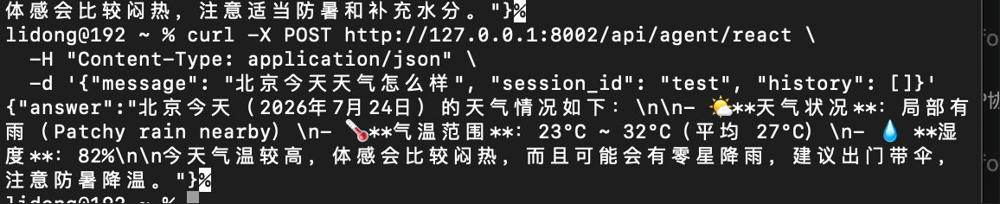
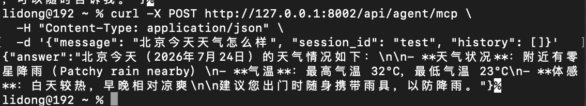
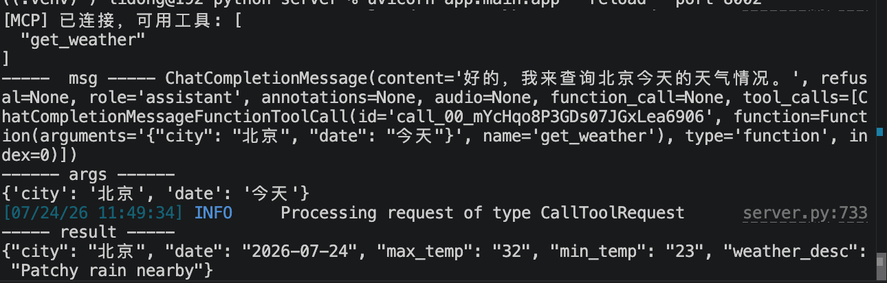

# MCP协议

> 📅 学习日期：2026-07-24
> 🔗 关联面试题：Agent 专题 题33（MCP 与 Skills 的差异及适用场景）、题32（AI Agent 中 Skills 的定义及作用）

## 1. 定义

MCP （模型上下文协议，Modal Context Protocol）是一个开放、标准化的通信协议，它定义AI应用（客户端）与外部工具/数据源（服务器）之间如何“发现能力”、“调用功能”和“传递上下文”的通用交互规范。

- 它的本质：一套通信规则
- 它的目标：打破AI应用与工具之间的私有壁垒。实现一次编写工具，任意AI应用调用。

### MCP的必要性

**解决“碎片化”和“高耦合”**

MCP出现之前，每个AI应用要为每个外部工具编写定制的集成代码，形成了M个AI应用 × N个工具的复杂集成难题，这会导致大量重复开发，也使系统维护变得困难。

MCP 通过定义一个统一的、与模型无关的标准化协议，让任意支持MCP协议的AI应用都能以相同方式连接任意支持MCP的服务器。开发者只需要为工具实现一次MCP接口，就能被所有支持MCP的AI应用使用。


## 2. MCP 架构

MCP 采用 客户端-服务器（Client-Server）架构，主要包含三个核心角色：

1. MCP 主机（MCP Host）：AI 应用本身，如Claude 桌面版、IDE 插件等，是发起连接的一方。

2. MCP 客户端（MCP Client）：运行在主机内部，负责与单个MCP 服务器建立和维护一对一连接的组件。

3. MCP 服务器（MCP Server）：轻量级服务程序，通过MCP协议向客户端暴露其功能，如访问本地文件、调用API或查询数据库。

### MCP Server 三大核心元语

MCP Server 主要向大模型暴露三种标准的服务能力。

- Resources（资源 - 只读上下文）：
    - 概念：由URI表示的静态或动态数据，供大模型作为背景知识读取
    - 例子：file:///logs/today.txt 或 postgres://db/users。模型不能“执行”它，但可以通过标准的resources/read 接口把这些实时数据无缝拉入大模型的Prompt上下文。

- Tools（工具 -- 可执行）：
    - 概念：大模型可以通过Function Calling 触发的、具备副作用的行动方案。
    - 例子：deploy_code(commit_id="abc") 或 send_slack_message(channel="ai")

- Prompt（提示词模版）：
    - 概念：由Server端预先定义好的、带参数的常用工作流模版
    - 例子：Server 提供一个名为 review-code 的模板，Host 点击或调用后，会自动拼装好最适合该 Server 环境的系统提示词。

## 3. MCP 通信机制与流程

### 通信与底层协议技术

- 传输层（Tranport）：MCP消息的底层承载方式主要由两种：
    - Stdio（标准输入输出）：当MCP Server运行在本地（和API客户端在一台电脑上）时，直接通过进程间的标准I/O管道通信，速度极快。
    - SSE（Server-Sent Events, HTTP）：当MCP Server 部署在云端服务器时，通过HTTP配合服务器发送事件进行长连接通信。
- 协议格式：统一采用经典的JSON-RPC 2.0规范进行异步、双向请求与响应。

### 流程
1. 基于 JSON-RPC 2.0：MCP 的底层通信协议采用 JSON-RPC 2.0，确保消息结构清晰、标准化

2. 能力协商：在连接初始阶段，客户端和服务器会明确声明各自支持的功能（如支持哪类工具）

3. 标准消息类型：定义了标准的消息来完成交互，例如：

    - ListToolsRequest：客户端请求服务器提供的工具列表

    - CallTollRequest：客户端调用服务器上的一个工具

    - ListResourcesRequest / ReadResourcesRequest：客户端请求和读取资源。

4. 上下文传递：MCP 协议支持在请求中传递上下文信息（如用户id、对话历史），并在响应中更新上下文，以保持多轮交互的完整性

5. 多传输方式：支持多种传输方式。Stdio、SSE。

6. 工具动态发现：客户端可以在启动时向服务器请求其支持的所有工具清单，实现动态发现。


## 4. MCP 与 Function Calling 关系与区别

1. 区别

| 对比维度 | Function Calling | MCP |
|------|------|------|
| 本质定义 | 技术能力（API 特性）：LLM 输出结构化 JSON 指令的能力 | 通信协议（标准规范）：AI 应用与外部工具交互的通用规则 |
| 核心解决 | “如何让 LLM 生成可执行的机器指令？”（模型输出格式） | “如何让 AI 应用发现、连接、调用各种异构工具？”（系统集成标准化） |
| 标准化程度 | 私有/厂商绑定：OpenAI、DeepSeek 等格式各有差异 | 跨模型跨平台通用：同一套 MCP 服务器可被多种 AI 应用复用 |
| 角色定位 | “翻译官”：自然语言 → 结构化函数名+参数 | “通用插座”：规定 AI 应用与工具服务器的接口标准 |
| 内容范围 | 单一：仅针对 Action（工具调用） | 三大原语：Tools（执行）+ Resources（读取）+ Prompts（模板） |
| 交互模式 | 点对点：单次请求-响应 | 客户端-服务器（C/S）：能力协商 + 动态发现 + stdio/SSE |
| 依赖关系 | 模型底层微调：需原生支持 tool_calls | 上层协议：不依赖模型能力，本地小模型也能跑 |

2. 关系

Function Calling 是“大脑”决策输出机制（内部能力），MCP 是“身体”连接外部世界的标准接口（外部协议）。它们不是替代关系，而是“决策层”与“传输层”的垂直协作关系。

- 它们处在流程中的位置

| 层级 | 对应公式要素 | 负责方 | 核心职责 |
|------|------|------|------|
| 决策层 (Decision Layer) | Planning + Action（决策部分） | LLM（大脑） | 理解意图，决定”要不要用工具””用哪个” |
| 接口层 (Interface Layer) | Action（执行部分）+ Tools | MCP 协议（神经/血管） | 将大脑决策通过标准化管道传递给手脚 |
| 执行层 (Execution Layer) | Tools（具体实现） | MCP Server / 外部 API（手脚） | 真正查数据库、调天气 API、发邮件 |

- 协作模式

    - FC做决策，MVP做路由

        1. MCP 拉取清单：Agent启动时，通过MCP 获取工具列表，并转成Deepseek的tools 参数。
        2. FC 做决策：用户问天气，DeepSeek返回tool_calls: {name: "get_weather", args: {city:"北京"}}
        3. MCP 执行路由：Agent 拿到这个JSON，不自己写代码去执行，而是通过MCP协议发送CallToolRequest给MCP Server
        4. 结果回传：MCP Server 执行完毕，通过MCP 管道返回 25°C。
    - 纯MCP, 绕过FC

        使用的模型不支持Function Calling，处理方式：
        - 流程：LLM输出纯文本Action: get_weather(city="北京") -》 Agent用正则解析出工具名和参数-》同样通过 MCP 协议发送 CallToolRequest。

        - 结论：MCP 不依赖 FC。即使没有 FC，MCP 依然能把“解析后的指令”传输出去。

    - 纯FC，绕过MCP
        直接把工具代码写在项目中，
        - 流程：FC输出JSON -> Agent 直接用if tool_name == "get_weather": requests.get(...) 硬编码执行。

        - 结论：FC 不依赖 MCP，但这样每加一个新工具，就要改代码、重启服务，这就是 MCP 要解决的“碎片化”问题。

- 数据流转
    1. MCP -> FC：协议格式 -》 API格式。MCP 返回的工具是通用JSON 格式（{"name":"get_weather","inputSchema":{...}}），Agent需要把它转换成Deepseek api 要求的特定格式（{"type":"function","function":{"name":"get_weather","parameters":{...}}}）。

    2. FC -> MCP：API输出 -> 协议请求，DeepSeek 返回的tool_calls是OpenAI特有的JSON 结构。Agent 需要提取出name 和 arguments，重新封装成MCP标准的CallToolRequest格式（{"method":"tools/call", "params": {...}}）


**一句话描述**：MCP 把“外部世界的工具”包装成标准化接口暴露给Agent，Agent把这些接口注册给LLM，LLM 通过Function Calling决定“点哪道菜”，点完后，Agent再通过MCP把“菜单”传给后厨（MCP Server）做菜。


## 5. MCP 文档

### 1. 服务器开发

- MCP Server 定义的工具函数

```python
from mcp.server.fastmcp import FastMCP
from typing import Annotated
from pydantic import Field

mcp = FastMCP("weather-service")

@mcp.tool()
def get_weather(
    city: Annotated[str, Field(description="城市名称，使用中文，例如：'北京'、'上海'")],
    unit: Annotated[str, Field(description="温度单位", default="celsius")] = "celsius"
) -> str:
    """获取指定城市的实时天气信息"""
    return f"{city} 的天气是晴天，25°C"
```
- 装饰器自动生成的“元数据”（JSON Schema 格式）
这是装饰器通过解析函数签名、类型注解和文档字符串后，在后台动态生成的 JSON 对象（MCP 协议标准格式）。它会存入服务器的内部注册表，并响应 tools/list 请求。

```JSON
{
  "name": "get_weather",
  "title": "获取指定城市的实时天气信息",
  "description": "获取指定城市的实时天气信息",
  "inputSchema": {
    "type": "object",
    "properties": {
      "city": {
        "type": "string",
        "description": "城市名称，使用中文，例如：'北京'、'上海'"
      },
      "unit": {
        "type": "string",
        "description": "温度单位",
        "default": "celsius"
      }
    },
    "required": ["city"]
  },
  "outputSchema": {
    "type": "string"
  }
}
```

-  服务器内部存储格式（Tool 对象）

在 Python 代码层面，装饰器会把上述 JSON 和原始函数封装成一个 Tool 对象，存在服务器的 _tools 字典里。这个对象的结构大致如下（简化版）：

```python
{
    "get_weather": {
        "fn": <function get_weather at 0x7f8a1c3d4e00>,  # 真正的 Python 函数
        "name": "get_weather",
        "description": "获取指定城市的实时天气信息",
        "input_schema": {
            "type": "object",
            "properties": {...},
            "required": ["city"]
        },
        "output_schema": {"type": "string"}
    }
}
```

### 2. 客户端开发

连接服务器：

```python
async def connect_to_server(self, server_script_path: str):
    """连接到 MCP 服务器

    参数：
        server_script_path: 服务器脚本路径 (.py 或 .js)
    """
    is_python = server_script_path.endswith('.py')
    is_js = server_script_path.endswith('.js')
    if not (is_python or is_js):
        raise ValueError("服务器脚本必须是 .py 或 .js 文件")

    command = "python" if is_python else "node"
    server_params = StdioServerParameters(
        command=command,
        args=[server_script_path],
        env=None
    )

    stdio_transport = await self.exit_stack.enter_async_context(stdio_client(server_params))
    self.stdio, self.write = stdio_transport
    self.session = await self.exit_stack.enter_async_context(ClientSession(self.stdio, self.write))

    await self.session.initialize()

    # 列出可用工具
    response = await self.session.list_tools()
    tools = response.tools
    print("\n已连接到服务器，可用工具:", [tool.name for tool in tools])
```

实际上请求服务器会被MCP转成如下：

```json
{
  "jsonrpc": "2.0",
  "method": "call_tool",
  "params": {
    "name": "get_weather",
    "arguments": {
      "city": "北京",
      "unit": "celsius"
    }
  },
  "id": 2
}
```

Server 返回的内容：

```json
{
  "jsonrpc": "2.0",
  "result": {
    "content": [
      {
        "type": "text",
        "text": "北京当前天气为晴天，温度25°C"
      }
    ]
  },
  "id": 2
}
```

### MCP Tool Schema 和 Function Calling Tool Schema的区别

| 特性 | MCP Tool Schema | Function Calling Schema（OpenAI/DeepSeek） |
|------|------|------|
| 外层容器 | 直接在 tools 列表中定义工具对象 | 每个工具对象必须包含 `type: "function"` 字段 |
| 工具名称 | `name` | `function.name` |
| 工具描述 | `description` | `function.description` |
| 参数定义 | `inputSchema` | `function.parameters` |
| 参数格式 | JSON Schema | JSON Schema |


1. MCP Server 定义：

```json
{
  "name": "get_weather",
  "description": "获取指定城市的天气",
  "inputSchema": {
    "type": "object",
    "properties": {
      "city": { "type": "string" }
    }
  }
}
```

2. Function Calling 定义：

```json
{
  "type": "function",
  "function": {
    "name": "get_weather",
    "description": "获取指定城市的天气",
    "parameters": {
      "type": "object",
      "properties": {
        "city": { "type": "string" }
      }
    }
  }
}
```


## 6. 实际效果对比

测试案例：**“北京今天天气怎么样”**

#### Function Calling 直接调用


#### MCP 协议调用



#### 核心差异
两次调用返回了相似的天气数据，但底层机制完全不同。FC 直接调用时，工具定义和执行逻辑都硬编码在项目里。MCP 调用时，Agent 通过标准化的 JSON-RPC 协议与独立的 Weather Server 通信——工具发现是自动的、工具执行是跨进程的、新增工具不需要改 Agent 代码。