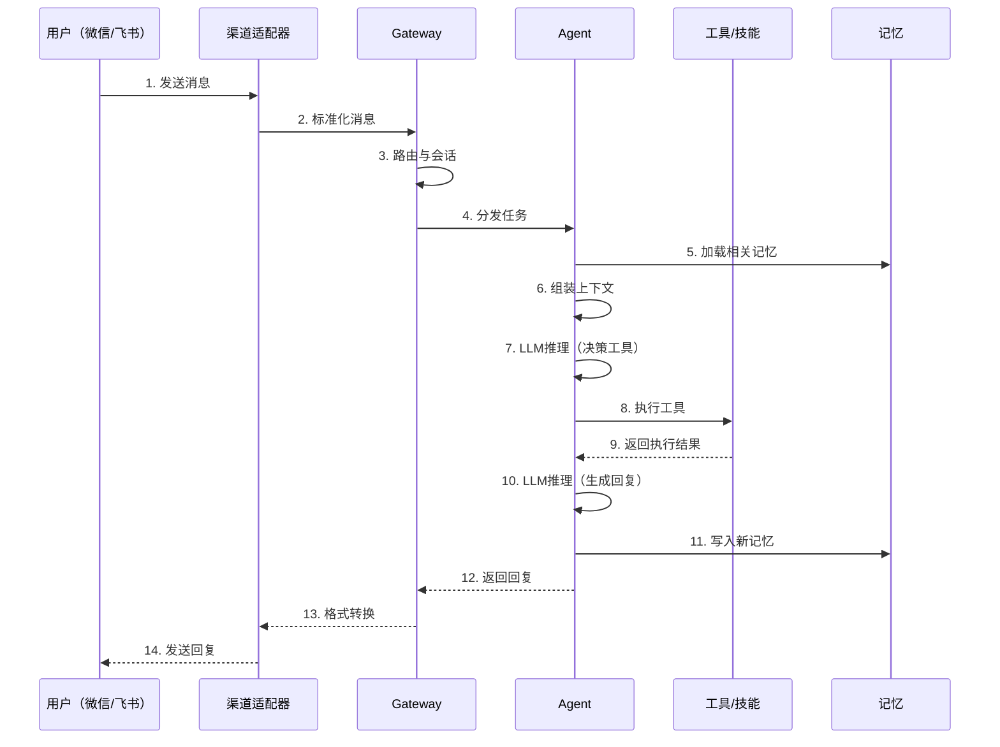
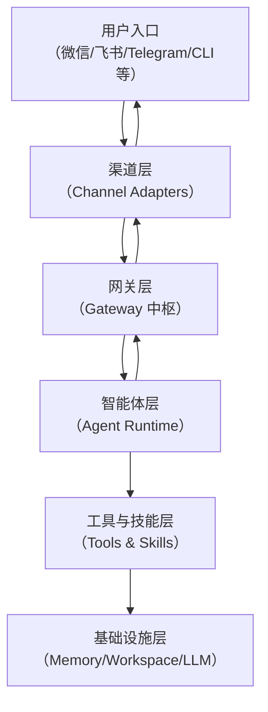

# OpenClaw 学习笔记

> 📅 学习日期：2026-08-10
> 🔗 相关主题：AI Agent、个人助理、自托管、多智能体

## 1. 什么是 OpenClaw？

### 1.0 30 秒快速体验

想象一下这个场景：

> 你在微信里发了一条消息：「帮我查下明天北京的天气，如果下雨就提醒我带伞」
>
> → 微信消息到达 OpenClaw 网关
> → Gateway 识别意图，路由给 Agent
> → Agent 调用天气 API 工具，查询明天天气
> → 发现明天有雨，Agent 生成回复：「明天北京小雨，气温 18-25°C，出门记得带伞！🌂」
> → 回复通过微信发送给你

**这就是 OpenClaw 的核心价值：用你最熟悉的聊天软件，指挥 AI 真正地"动手干活"。**

---

**一句话定义：**
OpenClaw 是一个**开源的、自托管的 AI 智能体网关**，让你能通过日常使用的聊天软件来指挥 AI 真正地"动手干活"。

它在社区有个有趣的昵称："龙虾"（Lobster）。

### 1.1 核心定位
- **自托管（Self-hosted）**：运行在你自己的电脑或服务器上，所有数据留存本地
- **个人 AI 助手**：7x24 小时在线、随叫随到
- **任务执行者**：不只能"动嘴"（聊天），更能"动手"（执行操作）

### 1.2 解决了什么问题？

| 问题 | OpenClaw 的解法 |
| :--- | :--- |
| AI 无法真正"行动" | 具备工具调用能力，能操作电脑、执行命令、控制浏览器等 |
| 数据隐私和安全 | **自托管**架构，所有数据在你的设备上，不经过第三方服务器 |
| 使用不便 | 支持通过微信、飞书、Telegram 等**已有的聊天软件**指挥，无需切换 App |
| 能力扩展受限 | 内置 49 个开箱即用的技能，通过"技能（Skills）"系统可无限扩展 |

### 1.3 项目概况
- **GitHub Star**：34 万+
- **内置技能**：49 个
- **支持渠道**：40+ 种通信平台
- **核心语言**：TypeScript

### 1.4 知识连接——和你已经学过的内容有什么关系？

OpenClaw 不是一个孤立的工具，它的很多设计思想你已经在之前的学习中接触过：

| OpenClaw 概念 | 你已经学过的对应知识 | 关联点 |
| :--- | :--- | :--- |
| **Agentic Loop**（接收→推理→行动→反馈） | **ReAct 模式**（思考→行动→观察→循环） | 同一个核心思想：LLM 在循环中决策和调用工具 |
| **Skills**（SKILL.md 描述任务步骤） | **Function Calling / MCP Tool** | 都是让 LLM 调用外部能力；Skills 更"高层"——用自然语言描述，而非 JSON Schema |
| **Gateway 消息路由** | **意图路由**（RAG 项目中的 Query Routing） | 都是"识别意图 → 分发到正确处理器"的模式 |
| **分层记忆**（MEMORY.md + 每日日志） | **跨会话记忆**（Agent 专题中的 ConversationBufferMemory） | 都是让 AI 记住历史；OpenClaw 更进一步，做了"新陈代谢"和混合检索 |
| **多渠道适配**（微信/飞书/Telegram） | — | 新概念：适配器模式在实际 AI 产品中的应用 |
| **工具执行审批** | — | 新概念：AI 安全中的"人在回路"（Human-in-the-Loop） |

> 💡 **学习建议**：读这篇笔记时，不断问自己——"这个概念和我项目里做过的哪个东西对应？" 这样 OpenClaw 就不是一个全新的、遥不可及的系统，而是你已有知识的"工程化升级版"。

---

## 2. 核心工作流程——一条消息的完整旅程

> 在深入架构之前，先看一张"全景地图"——用户在微信里发一条消息，背后发生了什么？



**关键理解**：这 14 步中，Gateway 是"交通指挥"（步骤 2-4, 12-14），Agent 是"大脑思考"（步骤 5-11），工具是"动手执行"（步骤 8-9）。三者分工明确，缺一不可。

---

## 3. 核心架构

### 3.0 架构一句话

> **"一个网关 + 多个智能体 + 可扩展技能 + 本地记忆"**

### 3.1 五层架构速览

在深入每一层之前，先用大白话理解每层是干什么的：

| 层 | 一句话类比 | 核心职责 |
| :--- | :--- | :--- |
| **渠道适配层** | 📞 翻译官 | 把微信/飞书/Telegram 的消息翻译成统一格式，让上层不用关心用的是哪个 App |
| **Gateway 中枢** | 🚦 交通指挥中心 | 消息路由、会话管理、安全审查——所有消息进出的"总闸" |
| **Agent 智能体** | 🧠 大脑 | LLM 推理决策，执行 Agentic Loop，决定"下一步该干什么" |
| **工具与技能** | 👐 手脚 | 执行具体操作：跑命令、读写文件、控制浏览器等 |
| **记忆层** | 📝 笔记本 | 长期记忆 + 每日日志，让 Agent 记住你是谁、之前聊过什么 |

### 3.2 架构图



### 3.3 各层详解

#### 🚪 交互入口层
- 用户与 OpenClaw 交互的起点
- 支持 40+ 种渠道插件：
  - **国内**：微信、飞书、钉钉、企业微信、QQ
  - **国际**：Telegram、WhatsApp、Discord、Slack、Signal

#### 🌉 渠道适配层
- **职责**：屏蔽不同平台协议差异的"翻译官"
- 处理各平台认证和授权
- 统一转换成内部标准消息格式
- 将 Agent 回复按原平台格式发送回去
- **价值**：上层 Agent 无需关心平台差异，专注处理业务逻辑

#### 🧠 网关层（Gateway）—— **核心中枢**
Gateway 是 OpenClaw 的**控制平面（Control Plane）**，是整个系统的 **"神经中枢"**。

**默认监听端口**：`127.0.0.1:18789`

**核心职责：**

| 职责 | 说明 |
| :--- | :--- |
| **消息路由** | 接收所有渠道的标准化消息，精准分发给对应的 Agent 会话 |
| **会话管理** | 维护每个用户/群聊的对话历史和上下文状态 |
| **连接管理** | 统一管理所有客户端（CLI、Web UI、手机 App）的 WebSocket 连接 |
| **安全与权限** | 验证身份、执行黑白名单、审批所有工具执行操作 |
| **事件广播** | 向所有连接的客户端实时推送状态更新 |
| **任务调度** | 操作队列管理，确保有序执行 |

#### 🤖 智能体层（Agent Runtime）—— **真正的大脑**
Agent 是负责调用大模型（LLM）进行**思考、推理和决策**的模块。

**核心工作循环（Agentic Loop）：**
1. **接收任务**：从 Gateway 获取用户消息
2. **组装上下文**：系统指令 + 历史对话 + 可用技能 + 记忆
3. **调用 LLM 推理**：让模型决定下一步动作
4. **执行工具**：根据模型决策调用对应工具
5. **生成回复**：基于执行结果生成自然语言回复
6. **持久化**：记录重要信息写入 Memory

**独立配置能力：**
- 每个 Agent 可拥有独立的**身份**（通过 `SOUL.md` 定义人格）
- 独立的**系统提示词**和**技能列表**
- 独立的**可用工具集**

#### 🛠️ 工具与技能层（Tools & Skills）
这是 OpenClaw 真正能"做事"的关键。

**工具（Tools）**：底层操作能力
- 执行 Shell 命令（`bash`）
- 读写文件（`read/write`）
- 浏览器自动化（`browser`）
- 控制摄像头（`camera`）
- 文件搜索（`find`）

**技能（Skills）**：高层扩展机制
- 一个 Skill 是一个 `SKILL.md` 文件
- 用**自然语言描述**任务步骤和工具调用
- **"文档即代码"**：写一份"说明书"，Agent 就能读懂并执行
- **支持嵌套**：一个 Skill 可以调用另一个 Skill
- 社区可共享，无需修改核心代码

#### 📝 记忆层（Memory）
- **存储方式**：Markdown 文件持久化到本地磁盘
- **目录位置**：`~/.openclaw/workspace/`
- **核心文件**：
  - `MEMORY.md`：长期记忆
  - `memory/YYYY-MM-DD.md`：每日日志
  - `AGENTS.md`：工作区指令
  - `DREAMS.md`：梦境日记（供人类审阅）

---

## 4. 记忆系统设计

### 4.1 分层存储架构

| 层级 | 存储位置 | 内容用途 | 写入方式 | 注入方式 |
| :--- | :--- | :--- | :--- | :--- |
| **工作区指令** | `AGENTS.md` | 静态指令、项目规则 | 人工编写 | **总是**在会话开始时注入 |
| **精选核心** | `MEMORY.md` | 长期记忆、精炼摘要 | "梦境"系统或用户请求 | **总是**在会话开始时注入 |
| **情节记忆** | `memory/YYYY-MM-DD.md` | 每日详细会话记录 | Agent 工作写入 | **从不自动注入**，通过 `memory_search` 按需检索 |
| **前瞻记忆** | SQLite | 定时任务、意图 | `intent` 工具触发 | 仅当触发器激活时 |
| **审核层** | `DREAMS.md` | 梦境整理报告 | "梦境"阶段写入 | 仅供人类阅读，从不注入 |

### 4.2 记忆的"新陈代谢"

**双源记忆架构**：
- **每日日志（动态记忆）**：原始对话记录
- **长期记忆（静态记忆）**：提炼后的核心知识

**晋升与降级**：
- 一周内被提到 **3 次以上** → 晋升到 `MEMORY.md`
- **30 天**未使用 → 降级回详细日志

**事实链（Supersede）**：
- 事实变更时**不覆盖旧记录**
- 通过 `superseded` 字段链接新旧事实
- 形成可追溯的完整历史链

### 4.3 记忆检索机制

**双路检索（Two-Path Recall）**：

| 检索方式 | 适用场景 | 覆盖范围 |
| :--- | :--- | :--- |
| **确定性查找** | 已知实体、精确匹配 | 约 90% 日常场景 |
| **语义搜索** | 模糊问题、不同措辞 | 基于向量嵌入 |

**混合搜索（Hybrid Search）**：
- **BM25 全文检索**：精确关键词匹配（SQLite FTS5）
- **向量语义检索**：语义层面关联
- **加权融合**：默认 **7:3**（语义 : 关键词）

**时间衰减（Temporal Decay）**：
- 模拟人类的"遗忘曲线"
- 默认半衰期：**30 天**
- 新记忆检索权重更高

### 4.4 "梦境（Dreaming）"系统
- 后台自动运行（如夜间）
- 三个阶段：浅睡 → 快速眼动 → 深睡
- 将短期记忆转化为长期稳定记忆

---

## 5. Agent 可靠性保障

### 5.1 第一层：模型调度与容错

**多模型冗余与自动降级**：
```json
{
  "model": [
    "claude-3-5-sonnet",
    "gpt-4o",
    "gemini-1.5-pro"
  ]
}
```

**API Key 健康轮询：**

- 多个 Key 自动调度
- 失败的 Key 进入冷却队列（默认 60 秒）
- 优先使用健康的 Key

**模型恢复：**主模型恢复后通过"健康探测"安全迁回。

### 5.2 第二层：运行与生命周期管理

**有界发布 + 活性证明**：
- 防止 Agent 进程被卡住永久占用会话
- 要求 Agent 执行关键操作时留下"活动证据"
- 证据链断裂 → 判定失效 → 强制回收

**Watchdog（看门狗）机制**：
- 防止 Agent "开空头支票"
- 超时时间：**30 秒**
- 最多重试：**3 次**
- 超时后自动注入系统提示推动继续执行

### 5.3 第三层：安全审查与风险控制

**沙箱隔离（Sandboxing）**：
- 文件系统访问限定在特定目录（如 `~/.openclaw/workspace-coder`）
- 任何尝试访问沙箱外路径的操作都被拒绝

**鉴别器层（Discriminator Layer）**——社区推进中：
1. **对齐评论家**：检查"工具调用是否符合用户原始意图？"
2. **安全评论家（Blinded）**：**仅根据工具调用本身**判断安全性，**不接触用户提示词**，不受提示注入攻击影响

**工具执行审批**：通过 `openclaw.json` 配置 `tools.exec` 权限

### 5.4 第四层：故障恢复与回退

- **模型调用失败回退**：保留原始用户任务，而非用"请继续"替换
- **会话与状态持久化**：即使 Gateway 重启，任务状态不丢失

### 5.5 第五层：可观测性与可靠性编码

**可靠性不变量（Reliability Invariants）**：
- 将关键的可靠性决策（如"持久化-确认"机制）
- 以文档形式记录在 `AGENTS.md` 中
- "把规则写进文档"，保障长期稳定性

**质量评级**：Agent Runtime 质量评级达到 **78%**（Beta 阶段）

---

## 6. 技术栈与相关资源

### 技术特点

| 特点 | 说明 |
| :--- | :--- |
| **语言** | TypeScript |
| **运行模式** | 长时间运行的后台进程（Gateway） |
| **通信协议** | WebSocket（实时双向通信） |
| **存储** | 纯文本 Markdown + SQLite 索引 |
| **集成方式** | 40+ 插件渠道、MCP 工具生态 |

### 相关资源

| 资源 | 链接 |
| :--- | :--- |
| **GitHub 仓库** | https://github.com/openclaw/openclaw |
| **官方文档（中文）** | https://docs.openclaw.ai/zh-CN/ |
| **中文文档站** | https://www.clawfather.cn/ |
| **中文文档项目** | https://github.com/liyupi/openclaw-guide |

---

## 7. OpenClaw 的局限性分析

> 本文档整理了 OpenClaw 在实际使用中暴露出的主要局限性，涵盖安全、性能、成本、理解能力、易用性、记忆系统及生态等多个维度。

### 7.1 🛡️ 安全风险：能力越大，风险越大

OpenClaw 最大的争议点在于其安全模型。由于其设计目标是"执行真实任务"，它被赋予了极高的系统权限，这带来了严重的安全隐患：

| 问题 | 说明 |
| :--- | :--- |
| **高风险能力** | 具备执行任意 Shell 命令、访问本地文件、调用 API 等高权限能力。默认配置下极易被滥用。 |
| **安全审计通过率低** | 由上海科技大学和上海人工智能实验室进行的审计显示，整体安全通过率仅为 **58.9%**。在 **"意图误解与不安全假设"** 维度上，通过率为 **0%**。 |
| **社区技能生态风险** | 社区贡献的技能中，**26%** 至少包含一个漏洞。恶意技能可能导致数据泄露、系统被控制等严重后果。 |
| **已知漏洞** | 已公开曝出多个高中危漏洞，如 `CVE-2026-41346` 允许攻击者发起拒绝服务（DoS）攻击。 |
| **提示词注入风险** | 攻击者可在网页中构造隐藏的恶意指令，诱导 OpenClaw 读取并执行，导致密钥泄露或执行非预期操作。 |
| **官方安全建议** | 国家互联网应急中心（CNCERT）建议用户在**专用设备、虚拟机或容器**中运行，**避免使用管理员权限**。 |

### 7.2 🐌 性能与稳定性：理想丰满，现实骨感

OpenClaw 在实际运行中，性能和稳定性问题非常突出：

| 问题 | 说明 |
| :--- | :--- |
| **单线程架构瓶颈** | Gateway 基于 Node.js 单线程事件循环设计，所有核心功能跑在同一线程上。任何 Agent 任务的阻塞都会拖垮整个系统。 |
| **"一个崩溃，全部崩溃"** | Gateway 一旦被插件拖挂、卡死或崩溃，整个 OpenClaw 彻底失控——远程消息进不来，指令发不出去，所有功能立即瘫痪。 |
| **响应延迟严重** | GitHub 报告显示，即使最简配置，WebSocket 响应时间高达 **15-100 秒**。Agent 内部处理耗时 **14-26 秒**。事件循环利用率（ELU）周期性达到 **100%**，阻塞所有其他工作。 |
| **普遍不稳定** | 大量用户报告任务执行不稳定，Agent 陷入"修复循环"或异常缓慢。有用户自嘲"装了两个 OpenClaw 左右互搏，一个挂了让另一个修"。 |

### 7.3 💸 高昂且不可控的使用成本

OpenClaw 的"全能"是用 Token "堆"出来的，推理成本可能远超预期：

| 问题 | 说明 |
| :--- | :--- |
| **Token 消耗巨大** | Agent 需反复进行"思考-行动-观察"循环，高频调用大模型导致 Token 消耗量巨大。 |
| **触目惊心的实际案例** | 用户使用智谱 GLM-4.7 交互 **20 余次**，花费 **200 元**。另一用户在云端部署体验 **48 小时**，仅模型"思考"就消耗 **一百多元** 的 Token。 |
| **成本与性能的两难** | 为降低成本，部分用户被迫选择更便宜的模型（如 Qwen-8B），导致能力严重缩水，**仅能回答问题而无法执行操作**。 |

### 7.4 🧠 理解与推理能力：有"手"无"脑"

OpenClaw 在执行层面很强，但在理解和推理层面存在严重缺陷：

| 问题 | 说明 |
| :--- | :--- |
| **缺乏本体论（Ontology）** | 有评论指出它是一个"缺乏本体的工具"，不知道自己是谁，没有自我角色认知。 |
| **不理解"业务"** | 能执行动作，但无法理解完整任务背后的商业逻辑和目标。 |
| **意图理解能力为 0** | 安全审计中"意图误解与不安全假设"通过率为 0%，会机械执行模糊指令，甚至造成破坏。 |
| **无法处理复杂逻辑** | 对于需要深入理解业务逻辑的复杂任务（如金融边界条件测试），完全无法胜任。 |
| **缺乏"怀疑精神"** | 会盲目执行指令、编造结果，不会对任务或执行过程产生质疑。 |

### 7.5 🧩 易用性与配置：极客的玩具，大众的门槛

对于非技术用户，OpenClaw 的上手门槛依然很高：

| 问题 | 说明 |
| :--- | :--- |
| **配置复杂** | 模型配置、API 限流处理等对普通用户仍是不小的挑战。 |
| **"半拉子工程"** | 出色完成演示级任务，但为了让其在真实场景中工作，可能需要花 **10 倍时间** 写配置文件、手动排错。 |
| **多平台集成痛苦** | 不同渠道集成体验差异巨大。钉钉等国内通道像"嫁接"的，缺乏核心管理能力。一次更新可能导致微信、企业微信、飞书等插件同时失效。 |

### 7.6 🧠 记忆与上下文召回：脆弱的"记忆力"

尽管设计了复杂的记忆系统，但实际使用中的可靠性仍受质疑：

| 问题 | 说明 |
| :--- | :--- |
| **召回能力弱** | 跨会话的真实对话中，任务和记忆召回能力太弱，难以让人信赖。 |
| **无法可靠记住信息** | 用户无法可靠依赖它记住项目优先级、明确的"记住这个"请求，或正确检索更新后的任务状态。 |
| **导致外部方案** | 因反复召回失败，部分用户选择在 OpenClaw 之外构建独立的任务或记忆系统。 |
| **QMD 后端的系统性问题** | 记忆后端存在超时、性能、搜索和结果等多方面问题，不稳定且不可靠。 |

### 7.7 📦 生态与维护：成长的烦恼

作为一个快速迭代的项目，生态和维护也面临压力：

| 问题 | 说明 |
| :--- | :--- |
| **安全漏洞与补丁赛跑** | 安全漏洞频发，用户需时刻关注并及时更新到最新版本以安装补丁。 |
| **巨大的维护压力** | 项目曾一度面临 **87.8% 的未解决问题率（439/500）** 和 **77.6% 的未处理 PR 率（388/500）**。 |
| **商业化前景受质疑** | 摩根士丹利在其报告中，对 OpenClaw 的大规模商业化应用前景提出质疑，认为其在技术、易用性和安全性方面仍面临重大障碍。 |

### 7.8 💎 总结

OpenClaw 是一个**充满矛盾的产物**：它凭借"个人 AI 助理"的愿景迅速走红，但其**安全性、稳定性、成本、理解能力**等方面的重大局限，使其目前更像一个**面向技术爱好者的高级"玩具"或实验性工具**，远未达到普通用户或企业可以放心依赖的"生产力工具"标准。

---

## 8. 面试怎么讲（3 分钟速览）

> **如果面试官问"你了解 OpenClaw 吗？说说它的架构"，你可以这样回答：**

"OpenClaw 是一个**开源的、自托管的 AI 智能体网关**，让你能通过微信、飞书这些日常聊天软件来指挥 AI 真正地动手干活。它的核心定位是：**个人 AI 助手**，7x24 小时在线，跑在你自己的设备上，数据完全自己掌控。

它的架构可以概括为 **'一个网关 + 多个智能体 + 可扩展技能 + 本地记忆'** 五层结构：

- **Gateway（交通指挥中心）** 是整个系统的最核心——它是一个常驻后台的进程，负责消息路由、会话管理、安全审查。好比小区门口的保安亭，所有进出的人和车都要经过它。
- **Agent（大脑）** 是负责调用 LLM 思考和决策的模块，通过一个持续的 Agentic Loop 来工作——这和你学过的 ReAct 模式是同一个思路：接收任务 → 组装上下文 → LLM 推理 → 执行工具 → 生成回复 → 持久化记忆，循环往复。
- **Skills 和 Tools（手脚）** 是它真正能干活的能力层。Skills 用 '文档即代码' 的方式扩展——写一份 SKILL.md 说明书，Agent 就能读懂并执行，不需要改代码。
- **Memory（笔记本）** 通过分层存储（长期记忆 + 每日日志 + 梦境整理）和混合检索（BM25 + 向量语义）实现长期记忆，还有"新陈代谢"机制——重要的晋升、过期的降级。

可靠性方面，它有一套五层纵深防御：多模型冗余和 API Key 健康轮询 → Watchdog 防卡死 → 沙箱隔离和鉴别器 → 故障恢复和回退 → 可观测性编码。

当然它也有明显的局限性——安全审计通过率只有 58.9%、单线程架构导致一个崩溃全部崩溃、Token 成本高（有人 48 小时花了一百多块）、意图理解能力弱。所以它现在更像一个技术爱好者的高级玩具，离企业级生产力工具还有距离。"

> **💡 面试要点**：讲 OpenClaw 时，主动提到它的局限性会让你显得客观、有深度，而不是在"背课文"。面试官更想听到的是你对技术的辩证思考。

---

## 9. 关键要点总结

| # | 核心要点 | 一句话说明 |
| :--- | :--- | :--- |
| 1 | **自托管网关** | 运行在自己设备上的 AI 控制中心，数据不经过第三方 |
| 2 | **多渠道接入** | 支持微信、飞书、Telegram 等 40+ 聊天平台，无缝融入日常工具链 |
| 3 | **Gateway 中枢** | 负责消息路由、会话管理、安全控制，是整个系统的交通指挥中心 |
| 4 | **Agentic Loop** | Agent 的核心工作循环：接收 → 推理 → 行动 → 反馈 → 持久化 |
| 5 | **技能即文档** | 通过 `SKILL.md` 用自然语言描述任务步骤，"文档即代码" |
| 6 | **分层记忆** | 长期记忆 + 每日日志 + 梦境整理 + 混合检索 |
| 7 | **纵深可靠** | 多模型冗余、Watchdog、沙箱隔离、鉴别器层、故障回退 |
| 8 | **数据主权** | 所有数据以 Markdown 文件持久化到本地磁盘，完全透明可审计 |

---

**关键词**：OpenClaw、Gateway、Agent、自托管、多渠道接入、技能系统、记忆系统、个人 AI 助理、AI Agent 网关
