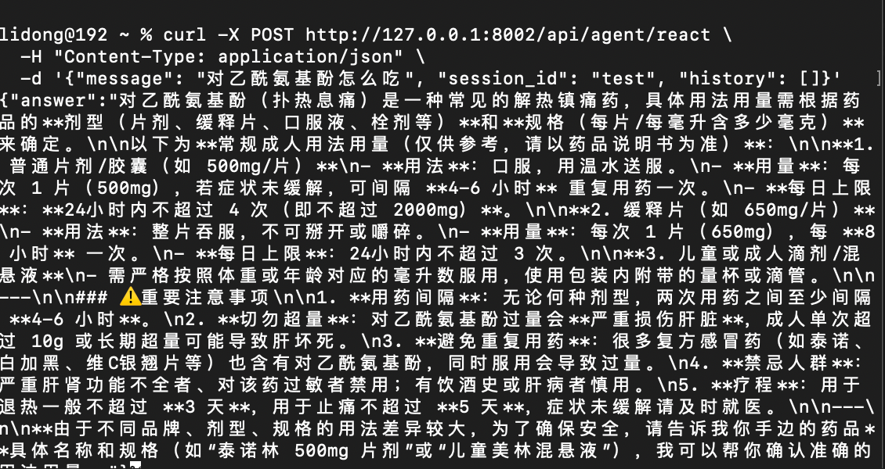
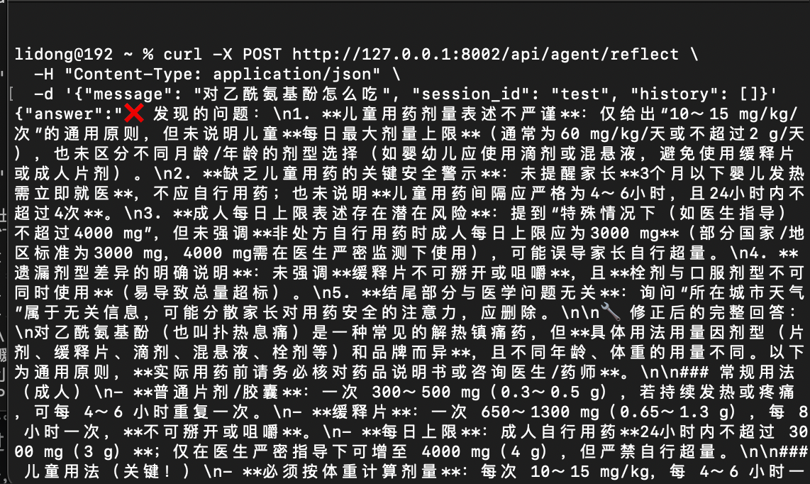

# Self-Reflection

> 📅 学习日期：2026-07-23
> 🔗 关联面试题：Agent 专题 题12（长期记忆 — Reflexion 向量库存储机制）、题17（死循环解决 — 反思触发退出）、多 Agent 辩论（阶段 3.5）

## 1. 为什么需要 Sel-Reflection？

在传统的单次生成（Zero-shot）或线性思考（CoT、ReAct）中，大模型普遍存在以下致命弱点：

- 一步错，步步错（幻觉滚雪球）：如果模型在多步推理的第一步产生了一个小幻觉，它会基于这个错误的假设继续往下编，导致最终答案完全崩盘。

- 工具调用死循环：在ReAct循环中，若API反复返回格式错误，模型往往缺乏“跳出来重新审视全局”的能力，只能盲目更换参数继续试错。

**Self-Reflection**的本质就是为 AI 引入心理学上的“元认知（Metacognition）”能力 -- 即“对自己的思考过程进行再思考”。

## 2. 核心定义

Self-Reflection 是指Agent在执行完成一个动作或完成一轮推理后，利用LLM对自身的“行为轨迹”和“最终结果”进行审视、批评（Critique）和修正，从而在没有外部监督的情况下，自主提升任务完成质量的能力。

## 3. 实现方式

1. Self-Refine 模式 --- 闭环的自我迭代

- 运行机制：完全在不依赖外部环境/工具反馈的情况下进行
    1. General：模版生成初始答案（OutPutA）
    2. Feedback：模型自己扮演批评家，分析OutPutA有哪些缺点、逻辑漏洞或不符合约束的地方。
    3. Refine：模型结合批评意见，重新生成优化后的答案（OutPutB）

- 适用场景：代码优化、文案润色、创意写作等主观性较强的任务

2. Reflexion（强化反思）--- 带记忆机制的ReAct升级版

- 运行机制：将反思转化为文字形式的强化学习
    1. Agent任务执行失败（例如：ReAct 循环了 5 次依然拿到了错误答案）。
    2. Agent强行停下，调用一个专门的“反思模型（Reflective LLM）”，把刚才失败的完整输入、执行轨迹（Thoughts/Actions/Observations）和错误提示全部喂给它。
    3. 反思模型生成一段纯文本的“经验教训记忆”（例如：“我不应该盲目相信第一条搜索结果，下次应该对比两条结果”）
    4. 清空当前的运行上下文，把这段“经验教训”作为长期记忆（Long-term Memory）塞进下一轮尝试的System Promopt中，重新开始任务。

- 适用场景：复杂的基准测试（如 HumanEval 代码题、WebArea 自动化网页操作 ）。

### 与传统反思的区别

| 维度 | Self-Refine（路径一） | Reflexion（路径二） |
|------|------|------|
| 反思结果去向 | 只作为当前任务的上下文 | 写入向量数据库，长期存储 |
| 错误是否被记住 | 任务结束后反思结果即丢弃 | 下次遇到类似问题，自动检索教训 |
| 典型实现 | 单次 API 调用链 | LangChain ConversationBufferMemory + 向量检索 |


- 核心实现三要素：
    - 执行器，生成初始答案或代码
    - 评估器，判断任务是否成功（可以用LLM打分，也可以用外部工具检查，比如运行代码看是否报错）**重点建议还是以外部工具为主，这个的返回比较客观，对就是对，错就是错。评估器的作用：只是判断任务是否成功，返回True/False，不做打分操作。**
    - 反思器：如果评估失败，使用当前的LLM，使用反思器对应的prompt，生成文本式的“教训”，并存入memory（向量库）。


3. 多角色反思 （Mutil-Agent Debate）

- 核心思想：引入独立的“批评家”（Critic），与“执法者Agent”完全解耦，通过多轮辩论达成共识。

- 适用场景：任务极其复杂，对准确性要求极高（如法律文书审核、医疗判断）

- 核心实现三要素：
    - 执行者Agent：负责产出内容（代码、文案、计划）
    - 批评家Agent：系统提示词被刻意设定为“极度挑剔”，专门找漏洞
    - 仲裁者Agent（可选）：当执行者和批评家陷入“无休止争吵”时，仲裁者根据规则（如最大轮次）强制终止

### 3种方式的对比

| 特性 | Self-Refine | Reflexion | 多 Agent 辩论 |
|------|:---:|:---:|:---:|
| 模型数量 | 1 个（轮流切换角色） | 1 个（执行+反思+记忆存储） | 2-3 个（不同角色独立） |
| Token 消耗 | 低（每轮 2 次调用） | 中（每轮 2-3 次调用+向量检索） | 高（每轮 4-6 次调用） |
| 反思深度 | 一般（受限于同一模型视角） | 中等（记忆累积效应逐步增强） | 极深（不同角色观点碰撞） |
| 典型框架 | 自行实现 | LangChain + 向量库（如 Chroma） | AutoGen / CrewAI |
| 适用任务 | 文案润色、代码优化 | 数学解题、多步推理 | 法律分析、战略决策 |

## Self-Reflection 和 ReAct的关系
1. 区别

| 维度 | ReAct | Self-Reflection |
|------|------|------|
| 核心循环 | Thought → Action → Observation | Action → Observation → **Reflection → Re-plan** |
| 思考对象 | "下一步该做什么？"（向前看） | "刚才那步做对了吗？"（向后看） |
| 触发时机 | 每次行动前 | 每次行动后（或任务失败时） |
| 核心目的 | 推进任务进度 | 纠正错误路径，避免一错再错 |
| 输出产物 | 具体的 Action（调用工具） | 文本形式的批评意见（如："查的数据是去年的"） |

### 在时间轴上的定位（何时发生）

| 维度 | ReAct | Self-Reflection |
|------|------|------|
| 触发时机 | 每时每刻：处理每个用户请求时必须运行 | 按需触发：仅在任务失败、结果不理想时才触发 |
| 作用阶段 | 执行期（Runtime）：控制 Agent 如何推进任务 | 反思期（Reflection Phase）：Observation 之后、Thought 之前 |
| 持续时间 | 贯穿 Agent 整个生命周期 | 瞬时的”脉冲”动作，完成后结果存入 Memory |

### 在认知功能上的定位（分别负责什么）

| 维度 | ReAct | Self-Reflection |
|------|------|------|
| 核心职责 | 向前推进（Progression）：决定”下一步做什么” | 向后审视（Retrospection）：决定”刚才做得对不对” |
| 输出产物 | 具体的 Action（tool_calls）或 Final Answer | 文本教训（Critique/Lesson），不执行外部操作 |
| 依赖信息 | 当前用户输入 + 短期记忆（本轮对话历史） | 完整行动轨迹（Trajectory）+ 外部评估信号 |

### 在经典公式中的落位

| 公式要素 | ReAct 的落位 | Self-Reflection 的落位 |
|------|------|------|
| Planning（规划） | Thought 就是动态规划——每次行动前想一步 | Reflection 是 Planning 的”修正器”，教训注入下一轮规划 |
| Action（行动） | Action 直接驱动工具调用 | 不产生 Action，只产生文本，不改变外部环境 |
| Memory（记忆） | 依赖短期 Memory（当前对话上下文） | 写入长期 Memory（向量库），将教训固化供未来检索 |
| Tools（工具） | 通过 Action 直接调用 Tools | 不调用 Tools（通常不鼓励） |


## 4. 反思的代码

- 反思的prompt，分为Critique（批评） 和 Refine（修正）

**其中Critique的prompt如下：**

**主要作用**：结合外部报错信息（硬反馈）或纯文本审查，输出具体的、可执行的批评意见。

 ```python
 【System Prompt】
你是一名极其严格的代码审查官（Code Reviewer）。你的唯一任务是找出【解决方案】中的具体缺陷。
你必须遵循以下硬性规则：
1. 忽视文风和编码习惯，只关注【逻辑错误】、【运行时异常】和【边界条件未处理】。
2. 如果提供了【外部报错日志】，你**必须**以报错日志为最高优先级依据，指出是哪一行代码触发了该异常。
3. 如果没有任何外部报错，你必须强制构造一个潜在的并发或数据为空的风险点。
4. 你的输出必须绝对具体，直接指出问题字段、函数名或行号，杜绝“代码可读性不佳”这种空话。

【用户原始需求】：
{user_query}

【待审查的解决方案】：
{actor_initial_output}

【外部执行报错日志（如有）】：
{external_error_log_or_observation}

请输出你的审查批评意见（只输出批评，不要输出修正后的代码）：
 ```

**Refine（修正）的prompt如下：**

**作用：**带着批评者的“骂声”，完全重写代码。

```python
【System Prompt】
你是一名资深技术专家。根据【用户原始需求】以及【审查批评意见】，**完全重写**一份新的解决方案。
注意：
1. 你必须严格规避批评意见中指出的所有错误。
2. 不要尝试在旧代码上“打补丁”，请输出一份全新的、完整的、可直接运行的方案。
3. 如果批评意见指出了参数错误，请确保新代码中的函数调用参数完全正确。

【用户原始需求】：
{user_query}

【上一轮错误的解决方案】：
{actor_initial_output}

【专家审查批评意见】：
{critic_output}

请生成修正后的最终完整解决方案：
```


- 如何LLM指出自己的错误，主要还是依赖于Prompt的约束设计。

| # | 技巧 | 说明 | Prompt 示例 |
|---|------|------|------|
| 1 | 设定严格的审查角色 | 不给”助手”的温和身份，而是专业审查者 | “你是一个严格的医学审查专家，找出错误而非赞美” |
| 2 | 强制输出审查点 | 要求逐条列出正确和有问题的地方 | “✅ 正确的部分：… ❌ 有问题的部分：… 🔧 修正后的回答：…” |
| 3 | 量化检查清单 | 给具体清单让 LLM 逐项核对 | “请检查：① 体温阈值 ② 药物剂量 ③ 月龄限制 ④ 用药间隔” |
| 4 | 负面提示 | 告诉 LLM”一定能找到问题” | “这份回答很可能存在 1-2 个医学错误，请仔细找出” |
| 5 | 强制修正 | 不只指出问题，必须给出完整修正 | “输出修正后的完整回答，不要只写修改建议” |


## 5. 和ReAct的组合方式

1. 事后总结型（经典的Reflection范式）

- 适用场景：数学解题、代码生成、多步推理（需要试错的任务）

- 核心逻辑：先完整跑完整个ReAct循环，等任务结束拿到最终结果后，再触发一次 Self-Reflection ，把整段行动轨迹喂给反思器，提炼教训存入长期记忆，下次重头再来。
    - 组合方式：[ 完整的 ReAct 循环（Thought-Action-Observation...直到 Final Answer） ] → [ 外部评估器检查结果 ] → [ 如果失败，触发 Reflection 生成教训存入 Memory ] → [ 新请求时，检索教训并重新运行 ReAct ]

    - 数据流向：Reflection 不介入本轮 ReAct 的实时决策，只影响下一轮 ReAct。

2. 实时修正型（内联Self-Refine 范式）

- 适用场景：文案润色、代码单轮优化（任务不复杂，但要求质量高，且不想多次调用外部工具）

- 核心逻辑：把Reflection整个塞进ReAct循环的Observation 和 Thought 之间，每执行完一次 Action 和 Observation，不急着进入下一次 Action，而是先触发一个微型的 Reflection ，根据结果修正下一步的 Thought。
    - 组合方式：Thought1 → Action1 → Observation1 → [ Reflection：这一步做得怎么样？如果不好，修正计划 ] → Thought2（修正版） → Action2...


3. 多智能体监督型（并行协作范式）

- 适用场景：超长任务、企业级应用（如金融审核、战略规划）

- 核心逻辑：两个独立的 Agent 并行运行。一个Agent 负责执行（ReAct 循环），另外一个独立的Agent负责监工（跑Reflection），它不执行任务，只持续读取执行 Agent 的mesaages历史，一旦发现轨迹偏离（比如连续2次调用同一个错误API），立刻发出“中断指令”注入上下文。

- 组合方式：
     - 执行者 Agent：正常运行ReAct循环
     - 监督者 Agent（Critic）：并行监控执行者的每一步 Thought 和 Action。


### 最佳实践

在实际生产环境中，99%的场景推荐使用第一种：事后总结。

原因：

1. 成本可控： Reflection 只在报错时触发一次，不会每步都烧 Token

2. 代码简单：不需要在ReAct中的while循环里嵌入复杂的条件判断，只需在循环退出后加一个if failed: reflect()

3. 记忆持久化：事后总结的教训可以存入向量库，下次用户问类似问题，直接拿出来用，越用越聪明。


## 6. 实际效果对比

测试案例：**“对乙酰氨基酚怎么吃”**

#### 普通 ReAct（无反思）


#### 带反思的 ReAct


#### 反思机制发现的问题
1. 未说明儿童每日最大剂量上限
2. 未提醒 3 个月以下婴儿发热需立即就医
3. 成人每日上限表述存在潜在风险
4. 遗漏剂型差异的明确说明
5. 结尾部分与医学问题无关

#### 结论
反思机制成功捕获了 5 个具体问题，修正后的回答在用药安全性、剂量精确性、剂型区分方面显著提升。这验证了外部批评式反思在医疗场景下的实际价值。
