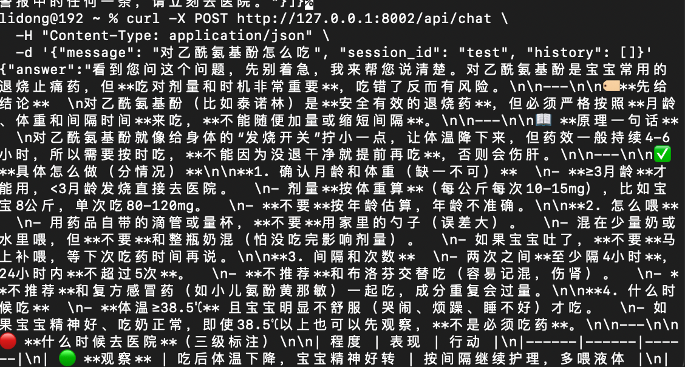
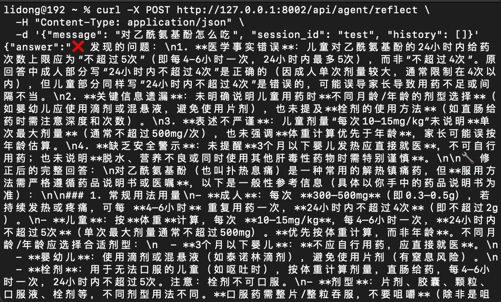
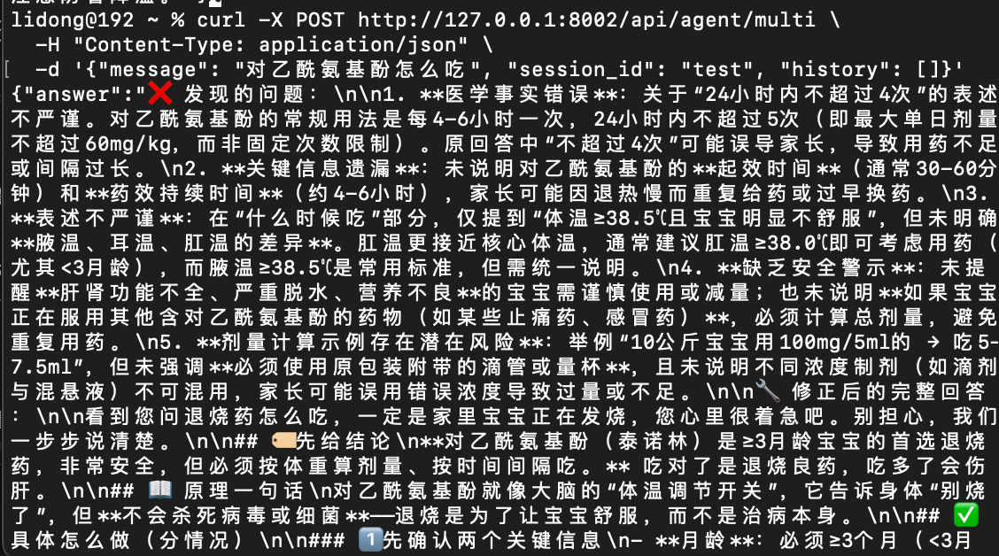

# 多Agent协作

> 📅 学习日期：2026-07-24
> 🔗 关联面试题：Agent 专题 题35-45（多 Agent 协作/OpenClaw 相关）、题40-42（多 Agent 通信与协作）

## 1. 定义

多 Agent 系统，是指有多个独立的 AI Agent 智能体通过协作、竞争或协商等方式，共同完成复杂任务的架构模式。

## 2. 必要性

**多 Agent 不是单 Agent 的"升级版"，而是"另一种架构选择"。单 Agent 够用时不硬拆——每多一个 Agent 就多一次通信延迟和出错的概率。多 Agent 的价值在于：任务可并行拆解、角色需要解耦、工具需要分权、或需要制衡式辩论。**

单 Agent 的局限：

1. **上下文窗口有限**：在 ReAct 中，由于单 Agent 需要包揽所有事情，它的长短期记忆、工具返回内容会全部堆积在同一个对话历史里。随着步数增加，Token 呈指数级消耗，且大模型容易在超长文中"迷失"。多 Agent 各自负责一部分，最后进行汇总。

2. **角色冲突**：同一个模型既当"创意者"又当"批评者"，容易陷入思维定势。多 Agent 允许你把不同的人设彻底解耦。

3. **缺乏制衡，极易越陷越深**：单 Agent 在自己犯错时，往往很难"打破砂锅问到底"地审视自己。而多 Agent 可以通过横向对立的角色强行终止错误逻辑。

4. **工具过多导致混淆**：给一个 Agent 塞 50 个工具，它可能选错。多 Agent 可以让每个 Agent 挂载自己相关的工具。

5. **串行效率低**：任务有依赖关系时，单 Agent 只能一步一步做，多 Agent 并行执行独立子任务，大幅缩短总耗时。

## 3. 多 Agent 架构模式

**本质分界：集权阵营的控制权在代码（显式路由），平权阵营的控制权在 LLM（隐式路由）。**

### 集权管理阵营（强调控制与秩序）

#### 3.1 主从模式（Master-Slave / Worker Pattern）

- **核心定义**：单中心结构，存在一个绝对的核心主管和若干个工具人专员。
- **沟通轨迹**：辐射状（星状拓扑）。用户 → 主管 → 专员 → 主管 → 用户。专员之间完全被屏蔽，互不知道对方的存在。
- **微观特质**：专员没有任何决策权，只负责执行主管分配的垂直任务并上报。
- **适用场景**：任务可明确分为独立子任务的场景（如写书、数据流水线）。
- **代表框架**：LangGraph（create_react_agent + 工具路由）、AutoGen（Group Chat 带 Manager）
- **数据流特征**：所有交互必须经过主管，串行决策，并行执行。

#### 3.2 层级模式（Hierarchical / Chain of Command）

- **核心定义**：主从模式的纵向多级延伸版。它引入了中间管理层（Middle Management），模仿了政府与跨国企业的树状组织结构。
- **沟通轨迹**：树状拓扑。用户 → CEO Agent → 技术总监 Agent → 组长 Agent → 程序员 Agent。数据逐级上报，指令逐级下达。
- **与主从的区别**：
  - 主从模式是扁平的单层管理（1个老板带10个员工）。
  - 层级模式是立体多层管理（老板带高管，高管带总监，总监带员工）。中间层 Agent 既是其下属的主管，又是其上司的专员，具备局部决策和任务二次拆解的能力。
- **适用场景**：企业级复杂流程（如合同审批、供应链调度）。
- **代表框架**：适合用 LangGraph 的 StateGraph 手写层级流转逻辑，或用 CrewAI 的 Sequential 嵌套。
- **数据流特征**：严格树形结构，自上而下传递命令，自下而上汇报结果。

### 平权民主阵营

#### 3.3 协作模式

- **核心定义**：无中心化的团队合作结构。所有的 Agent 级别平等，围坐在一张"圆桌"上（共享全局状态机或消息队列），为了一个共同的目标分工配合。
- **沟通轨迹**：网状拓扑 / 广播机制。Agent A 做完一部分工作，把结果丢进公共群聊，Agent B 发现自己擅长接下来的活，主动认领并继续推进。
- **微观特质**：大家相敬如宾，互相补位。沟通的目的是"信息共享"和"交接棒"，不带有强烈的攻击性。
- **适用场景**：需要头脑风暴、创意碰撞的任务（如营销策划）。
- **代表框架**：AutoGen（Group Chat）、CrewAI（process）。
- **数据流特征**：完全并行，无中心控制。依赖 LLM 的自律来决定何时发言、何时收尾，容易发散，需要 max_rounds 控制。

#### 3.4 辩论模式

- **核心定义**：带有强对抗性、批判性的协作模式。多个地位平等的 Agent 针对同一个输入，故意站在对立的立场进行多轮博弈、质疑和挑刺。
- **沟通轨迹**：交叉对立拓扑。Agent A（正方观点）↔ 疯狂相互攻击 ↔ Agent B（反方观点）。最后通常由一个独立的裁判节点或投票机制收敛出最终答案。
- **与协作的区别**：
  - 协作模式追求的是"效率与合力"，大家目标一致，顺着往前走。
  - 辩论模式追求的是"质量与去伪"，大家故意唱反调，通过无情的批判把大模型的幻觉和漏洞逼出来。
- **适用场景**：法律论证、复杂逻辑推理、需要规避偏见的策略。
- **代表框架**：LangGraph（加入判断节点）、AutoGen（Two Agent 带反思）。
- **数据流特征**：对抗性循环，靠"碰撞"修正幻觉，效果极好但 Token 消耗极大。


### 3.5 集权 vs 平权：如何选择？

| 维度 | 集权阵营（主从/层级） | 平权阵营（协作/辩论） |
|:---|:---|:---|
| **任务确定性** | 高（知道要拆成几步） | 低（需要探索式推理） |
| **容错要求** | 高（不能跑偏） | 中（可接受发散再收敛） |
| **Token 预算** | 低（控制流靠代码，不用 LLM 选人） | 高（每轮都靠 LLM 决策发言） |
| **典型场景** | 数据流水线、代码生成流水线 | 创意策划、法律论证 |

**一句话原则：能显式路由解决的问题，绝不交给 LLM 做路由决策。**

## 4. 主流 Agent 框架

| 框架 | 核心定位 | 架构模式 | 适用场景 | 优点 | 缺点 |
|:---|:---|:---|:---|:---|:---|
| **LangGraph** | 状态机驱动的精密编排 | 图结构：任务定义为节点，状态在边间流转 | 需精细控制和审计追踪的复杂工作流 | 灵活性极高，状态管理强大 | 学习曲线陡峭，需手动定义状态 |
| **AutoGen** | 高级多智能体对话系统 | 对话式：智能体通过"群聊"自由发言 | 代码生成与执行、人机协同复杂任务 | 支持复杂多智能体对话和代码执行 | 系统复杂度高，与微软生态集成紧密 |
| **CrewAI** | 基于角色的智能体协作编排 | 角色驱动：为智能体定义角色、目标和工具 | 快速构建原型、模拟人类团队协作 | 极易上手，10分钟可搭建演示 | 单线程架构，高并发下延迟明显，适合中小型串行任务 |
| **Microsoft Agent Framework** | 企业级数据流编排 | 数据流：类型安全的边连接，显式数据路由 | 强类型可审核的企业级应用，深度集成 Azure | 企业级可靠性，Azure生态无缝集成 | 平台依赖性强 |

**补充框架：MetaGPT**

- **核心思想**：它将软件公司的标准作业流程编码进多智能体系统。只需输入一行需求，就能模拟一个软件公司，让扮演产品经理、架构师、工程师等角色的智能体协作，输出用户故事、API设计、代码等。
- **定位**：在"自动化软件开发"这个垂直领域表现突出，是早期探索"流水线式"协作的经典框架之一。


## 5. LangGraph

### 5.1 设计思想

LangGraph 的核心思想是**倒置控制权**：

- 路由、跳转和流转控制：100% 交给人类的传统硬编码。
- 节点内的具体工作：才交给大模型的推理能力（如意图识别、Function Calling、文本润色）。

### 5.2 核心组成

- **状态（State）—— 全局共享的数据库**

  LangGraph 的核心是一个 StateGraph（状态图）。图中的所有节点都共享同一个中央状态。
  - **技术本质**：它是一个 Python 的 TypedDict 或 Pydantic 模型。
  - **流转机制**：当数据流经某个 Agent 节点时，该节点不能直接覆盖全局变量，而是通过**追加**或**局部更新**的方式修改状态。这样可以确保历史上下文永远不会丢失。

- **节点（Node）—— 算力单元（Agent 专员）**

  图中的每一个点就是一个 Node。
  - **技术本质**：它就是一个普通的 Python 函数（同步或异步 `async def`）。
  - **职责**：接收当前的 state，利用大模型或外部处理工具处理数据，然后返回更新后的 State。

- **边（Edges）—— 路由指挥官**

  决定了数据离开当前节点后，下一步应该流向哪里。LangGraph 提供了两种边：
  - **普通边（Normal Edge）**：硬编码。A 节点执行完，必定无条件跳转到 B 节点（适用于流水线模式）。
  - **条件边（Conditional Edge）**：根据大模型的判断结果动态决定去向。例如：让 LLM 检查上一步的结果，如果"合格"跳转到交付节点，如果"不合格"跳转回重写节点（适用于 ReAct 循环、主从模式、Self-Reflection 反思流）。

### 5.3 优点

- **内存持久化存储与"多轮人机交互"**

  框架自带 CheckPointer（检查点机制）。当 Agent 执行到敏感节点（如"准备扣款"、"准备发送群发邮件"）时，代码可以硬性触发 `interrupt_before`（前置拦截）。此时 Agent 会自动冻结所有状态并存入数据库。直到人类管理员在后台点击"审批通过"，Agent 才会反序列化苏醒，带上记忆继续往下跑。

- **完美的"时间旅行"**

  由于每一轮的状态都被检查点记录，如果 Agent 在第 15 步崩溃了，工程师不需要从第 1 步重新测试。你可以利用代码直接回滚到第 14 步的状态，修改提示词后直接重放，极大降低了 Agent 的调试成本。

- **原生支持动态并行（Parallel & Send）**

  通过简单的语法，它可以让主管节点分析完需求后，同时并发几百个子节点分头处理数据，最后自动汇聚。在处理海量文档分片或大规模网络扫描时效率极高。

### 5.4 代码示例

```python
from langgraph.graph import StateGraph, END
from langgraph.checkpoint import MemorySaver
from typing import TypedDict

# 1. 定义状态
class AgentState(TypedDict):
    query: str
    retrieved_docs: list[str]
    draft: str
    final_answer: str

# 2. 定义节点函数
def retriever_node(state: AgentState):
    # 模拟检索
    docs = ["文档1内容...", "文档2内容..."]
    return {"retrieved_docs": docs}

def generator_node(state: AgentState):
    # 根据检索结果生成初稿
    draft = f"基于{len(state['retrieved_docs'])}份文档生成的报告..."
    return {"draft": draft}

# 3. 条件边：判断是否需要重写
def should_revise(state: AgentState):
    # 真实场景中这里会调用 LLM 做质量打分
    if len(state["draft"]) < 10:  # 太短，视为不合格
        return "revise"
    return "end"

# 4. 构建图
graph = StateGraph(AgentState)
graph.add_node("retriever", retriever_node)
graph.add_node("generator", generator_node)
graph.add_conditional_edges("generator", should_revise, {
    "revise": "generator",  # 不合格则回到 generator 重写
    "end": END
})
graph.set_entry_point("retriever")

# 5. 编译并执行（含持久化 + 人机协同）
app = graph.compile(checkpointer=MemorySaver())
app.invoke(
    {"query": "多Agent系统是什么？"},
    config={"thread_id": "user_session_123"}  # 用于持久化隔离
)
```


## 6. 多 Agent 系统中消息路由的设计

### 6.1 维度一：路由拓扑（消息能传到哪？）

这决定了 Agent 之间的物理或逻辑连接方式：

| 拓扑类型 | 通信方式 | 适用场景 |
|:---|:---|:---|
| **星型（中心化）** | 所有消息经过主管 Agent，由它分发和汇总 | 主从模式，控制力强，但主管容易成为瓶颈 |
| **总线型（广播）** | 消息发到共享消息队列，所有 Agent 监听并自行响应 | 协作模式（如 AutoGen 群聊），松耦合，易产生消息风暴 |
| **网状（点对点）** | Agent 之间直接通信，知道彼此的存在和地址 | 辩论模式（正反方直接互怼），延迟最低，连接管理复杂 |
| **树形（层级）** | 消息逐层传递，上层派发，下层汇报 | 层级模式（企业流程），职责清晰，跨层通信须经中间层 |

### 6.2 维度二：路由策略

这是路由设计的核心智能所在——如何决策消息的下一跳。主流的策略分为以下四类：

| 策略类型 | 决策依据 | 实现方式 | 典型框架 |
|:---|:---|:---|:---|
| **显式路由（确定性路由）** | 预定义的固定规则（如：A→B→C） | 硬编码或配置文件，完全可预测 | CrewAI（顺序任务链） |
| **基于 LLM 的选择器** | LLM 阅读上下文，动态决定下一位发言者 | 调用 LLM，传入历史对话和 Agent 描述 | AutoGen（select_speaker） |
| **条件/状态路由** | 根据任务状态或工具返回结果分支 | 代码条件判断（if error→AgentB else AgentC） | LangGraph（条件边） |
| **内容/语义路由** | 根据消息的语义主题（意图）路由 | 向量检索匹配消息与 Agent 专长相似度 | 自研系统（客服路由） |

### 6.3 维度三：消息协议

在 Agent 之间传递的消息，必须包含足够的信息让接收方知道"如何处理"。一个标准的多 Agent 消息通常包含以下字段：

```python
# 标准消息结构（简化版）
class AgentMessage:
    sender: str          # 发送者ID（哪个Agent发的）
    receiver: str        # 接收者ID（发给谁的，广播则为'*'）
    msg_type: str        # 消息类型（"request", "response", "error", "broadcast"）
    content: str         # 实际载荷（自然语言指令或结构化数据）
    context_snapshot: dict  # 当前全局状态快照（防止上下文丢失）
    timestamp: str       # 时间戳
    correlation_id: str  # 关联ID（用于追踪多轮对话链路）
    hop_count: int = 0   # 建议加上，用于防止死循环
```
### 6.4 主流框架中的实现对比

| 框架 | 路由方式 | 具体实现 |
|------|------|------|
| LangGraph | 图节点 + 条件边（最灵活） | 手写 Python 函数，根据状态返回值决定下一节点 |
| AutoGen | LLM 驱动的发言者选择 | GroupChatManager 调用 LLM，传入 Agent 描述预测下一位发言者 |
| CrewAI | 预定义链式路由 | Sequential 严格按任务列表顺序；Hierarchical 由经理分配 |
| Microsoft Agent Framework | 类型安全的数据流边 | 强类型定义输入输出，类型不匹配编译报错，强制显式路由 |

### 6.5 设计消息路由时必须解决的“三大难题”

| # | 难题 | 表现 | 解决方案 |
|---|------|------|------|
| ① | **路由死循环** | Agent A→B→A→B 无限对话 | 增加 `hop_count` 超阈值强制终止，或设置主题收敛检测 |
| ② | **消息风暴** | 广播模式一条消息引发所有 Agent 同时响应 | 优先级队列限制每轮最大发言数，语义去重合并相同意图 |
| ③ | **上下文碎片化** | 消息经多跳后丢失原始用户意图 | 强制每条消息携带不可变的 `original_goal` 字段 |

### 6.6 实践中的黄金法则

1. **优先使用“显式路由”**：对于生产级系统，能用代码条件分支（LangGraph风格）解决的问题，就不用LLM来选择发言者（AutoGen风格）。显式路由可控、可调试、成本低。

2. **LLM路由只用在“开放性”场景**：只有当你无法预先定义所有分支（如开放式头脑风暴）时，才启用LLM选择下一位发言者，并务必加上max_rounds保险。

3. **状态快照 > 增量更新**：传递消息时，附上当前全局状态的快照（哪怕只传关键字段）。这能避免Agent因“记忆偏差”产生幻觉，是容错设计的关键。

### 6.7 多Agent消息路由：一句话本质

**消息路由 = 决定“这句话（任务/数据）接下来由哪个Agent来处理”。**

> 等同于公司里“手里有个活儿，是直接找同事、发部门群，还是让经理分配”。

### 6.8 核心三维度（对照“请示工作”）

| 维度 | 技术术语 | 核心问题 |
| :--- | :--- | :--- |
| **汇报模式** | **路由拓扑** | 消息能传到哪？通信边界是什么？（星型/树形/广播/网状） |
| **汇报方式** | **路由策略** | 谁来决定下一站？是代码硬规则还是LLM随机应变？ |
| **汇报内容** | **消息协议** | 消息长什么样？必须包含哪些字段才不“变味”？ |

---

### 6.9 两种路由策略的本质区别（最重要！）

| 对比项 | **显式路由（确定性路由）** | **隐式路由（LLM驱动）** |
| :--- | :--- | :--- |
| **决策者** | 开发者的代码（if-else） | 大模型（LLM）读上下文判断 |
| **特点** | 铁轨铺到哪，火车开到哪。**稳、快、便宜**。 | 有个聪明秘书动态分析。**灵活、贵、可能抽风**。 |
| **代表框架** | LangGraph、CrewAI（顺序链） | AutoGen（select_speaker） |

## 7. 三种路由对比

测试案例：**“对乙酰氨基酚怎么吃”**

| 路由 | 流程 | 特点 |
|------|------|------|
| `/api/chat` | RAG 管道 | 检索→生成，无反思 |
| `/api/agent/reflect` | 单 Agent + 反思 | ReAct→生成→反思修正 |
| `/api/agent/multi` | 多 Agent 流水线 | 检索Agent→生成Agent→审核Agent，职责分离 |

#### 7.1 `/api/chat`（RAG 管道）


#### 7.2 `/api/agent/reflect`（单 Agent + 反思）


#### 7.3 `/api/agent/multi`（多 Agent 流水线）


#### 7.4 核心差异
- **RAG 管道**：最基础的检索+生成，没有反思环节，可能遗漏关键安全信息。
- **单 Agent + 反思**：增加了反思修正，能发现并补充遗漏，但所有逻辑耦合在一个 Agent 中。
- **多 Agent 流水线**：将检索、生成、审核拆分为独立 Agent，职责清晰，可独立优化和替换。

**反思 vs 审核的本质区别**：

- **反思（Reflection）**：自己审视自己，内省式改进。问题是——如果自己能力不足，可能看不出自己的问题。
- **审核（Audit）**：独立的第三方 Agent 专门负责挑刺。由于审核 Agent 的视角和工具集与生成 Agent 完全不同，它更容易发现"当局者迷"的盲区。

---

## 8. 面试怎么讲

> "多 Agent 不是单 Agent 的升级版，而是另一种架构选择。单 Agent 够用时不硬拆——每多一个 Agent 就多一次通信和出错的概率。多 Agent 的价值体现在四个场景：任务可并行拆解、角色需要解耦（创造者和批评者分开）、工具需要分权（一个 Agent 挂 50 个工具会选错）、或者需要制衡（辩论模式逼出幻觉）。
>
> 架构上分两大阵营：集权派（主从/层级）适合流程确定性强的任务，平权派（协作/辩论）适合需要碰撞出质量的任务。框架选型上，需要精细控制选 LangGraph，快速原型选 CrewAI，代码协作选 AutoGen。
>
> 我的 baby-ai 目前 90% 场景单 Agent 就够。如果后期需要并行处理异构信息（比如体检报告分析 + 喂养建议同时出），会用主从模式——主管 Agent 拆任务、两个专员 Agent 并行执行、汇总输出。"

## 9. 项目关联

### 当前实现

baby-ai 中已落地多Agent流水线（`multi_agent_pipeline`）——将检索、生成、审核拆分为三个独立Agent，顺序协作：

- **检索Agent**（`retrieval_agent`）：负责混合检索（Dense + Sparse），从知识库中召回相关文档
- **生成Agent**（`generation_agent`）：负责Prompt拼接 + DeepSeek生成初步回答
- **审核Agent**（`review_agent`）：复用反思机制（`reflect_and_correct`），作为独立的第三方审查节点

三个Agent职责单一、可独立优化。当前采用**显式路由**（确定性流水线），因为育儿问答场景的任务确定性高，不需要LLM动态决策发言顺序。

### 关键设计决策

| 决策点 | 选择 | 原因 |
|--------|------|------|
| 路由方式 | 显式路由（硬编码顺序） | 任务确定性高，显式路由可控、可调试、成本低 |
| Agent 数量 | 3个（不拆分意图路由/查询重写） | 轻量文本处理更适合作为检索Agent内部预处理，不值得单独成一个Agent |
| 审核Agent的消息源 | 使用原始`user_message`而非改写后查询 | 审核需站在用户视角检查，原始表述才是意图锚点 |

### 后续升级方向

如果遇到需要并行处理异构信息的需求（如同时分析体检报告 + 给出喂养建议），会引入**主从模式**——主管Agent拆任务、两个专员Agent并行执行（`asyncio.gather`）、汇总输出。前期不需要引入框架，Python原生异步并发就能实现，后续根据复杂度决定是否引入LangGraph的状态图编排。

### 代码位置

- 多Agent流水线：`app/services/agent.py` → `multi_agent_pipeline`
- 三个独立Agent函数：`retrieval_agent` / `generation_agent` / `review_agent`
- 路由：`app/main.py` → `/api/agent/multi`
- 单Agent+反思：`app/main.py` → `/api/agent/reflect`（保留，用于对比）

