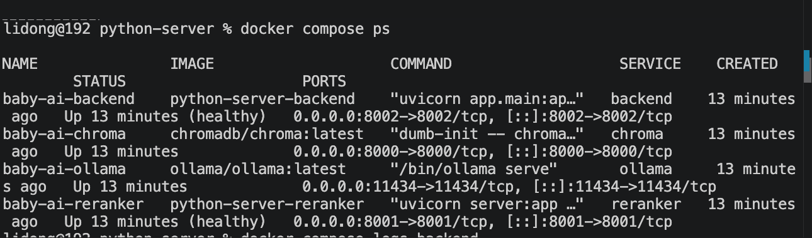

# Docker基础

> 📅 学习日期：2026-07-28
> 🔗 关联面试题：工程化 & 高并发 题15（Docker+K8s 部署 Agent/LLM 服务的注意事项）

## 1. 概念

Docker 是一个开源的容器化平台，它允许你将应用程序及其所有依赖项（代码、运行时、系统工具、库）打包到一个称为“容器”的标准化单元中。

### 1.1 作用

在Docker 出现之前，开发和运维之间最经典的撕逼场景：

> 开发者：“代码在我本地跑得好好的啊！肯定是服务器环境有问题！”

> 运维：“我服务器环境干干净净的，是你的代码有问题！”

Docker的解法：把“代码” + “运行环境（操作系统配置、依赖库、环境变量）”一起打包成一个镜像(Image)。这个镜像装到任何安装了Docker的机器上，都能跑出一样的效果。

### 1.2 核心概念

1. 镜像(Image)，通俗类比，制作披萨的”食谱、模具“。它是只读的模板。一个轻量的、可执行的软件包，包含了运行应用所需的一切。

2. 容器(Container)，通俗类比，用模具做出来的“热乎披萨”。它是可以跑起来的实体。镜像运行的实例，多个容器可以共享同一个实例，但彼此隔离（有个各自的内存、CPU、文件系统）

3. 仓库(Registry)，通俗类比，披萨菜谱的”github“（如Docker hub），存放并分享镜像的地方。你可以从仓库拉取别人做好的镜像，也可以推送自己做的。

4. 卷（Volume），通俗类比，存放披萨原料的“冰箱/保鲜盒”。容器关了，原料还在。Docker 管理的持久化存储空间，数据独立于容器的生命周期，容器删除后卷中的数据依然存在。

**流转关系**

- 仓库 -》拉取-》镜像-》运行-》容器

- 容器 -》写入数据 -》卷（持久化）

- 卷 -》挂载 -》新容器（复用）

### 1.3 Docker 和 虚拟机（VM）的区别

| 维度 | 虚拟机（VM） | Docker 容器 |
|------|------|------|
| **抽象层级** | 抽象硬件层（模拟完整物理电脑） | 抽象操作系统层（直接调用宿主机内核） |
| **启动速度** | 分钟级（需启动完整 Guest OS） | 毫秒/秒级（直接启动进程） |
| **资源占用** | 极重（几 GB 起） | 极轻（MB 级，共享宿主机内核） |
| **隔离级别** | 完全隔离（强安全性） | 进程级别隔离（轻量但共享内核） |


### 1.4 常用命令

```bash
# 1. 拉取镜像（比如拉一个 Python 环境）
docker pull python:3.11-slim

# 2. 运行容器（把代码挂载进去跑）
docker run -it -v $(pwd):/app -w /app python:3.11-slim python your_script.py

# 3. 查看正在运行的容器
docker ps

# 4. 构建自己的镜像（根据 Dockerfile 打包）
docker build -t my-mcp-server:latest .

# 5. 进入运行中的容器执行命令
docker exec -it <容器名> <命令>

# 6. 一键启动多个服务
docker compose up

# 7. 创建名为 my_mcp_data 的卷
docker volume create my_mcp_data

# 8. 运行容器，把这个卷挂载到容器的 /app/data 目录
# 容器往 /app/data 写的任何东西，都会永久存在 my_mcp_data 里
docker run -v my_mcp_data:/app/data my-mcp-image

# 9. 把当前本地的代码目录（pwd）映射进容器的 /app
docker run -v $(pwd):/app python:3.11 python /app/server.py

```

### 1.5 Docker 三大存储方式

| 存储类型 | 通俗类比 | 数据存在哪 | 删容器后还在？ | 适用场景 |
|------|------|------|:---:|------|
| 卷（Volume） | Docker 官方管理的”保险箱” | Docker 专属目录（`/var/lib/docker/volumes/`） | ✅ | 生产环境：数据库、日志 |
| 绑定挂载（Bind Mount） | 电脑桌面文件”映射”进容器 | 宿主机任意绝对路径 | ✅ | 本地开发：代码热更新 |
| tmpfs 挂载 | 内存条里的”临时草稿纸” | 宿主机内存（RAM），不写硬盘 | ❌ | 临时缓存、敏感凭证 |

### 1.6 端口映射

**定义**：把”容器内部程序正在监听的端口“映射到”宿主机（电脑或服务器）上的某个端口”，能从外部访问容器里的服务。

**为什么需要端口映射**

Docker 容器是一个独立于宿主机的“沙盒”，它有自己的虚拟 IP 地址和网络空间。如果不做端口映射：

- 你在容器里启动了一个 Web 服务（监听 80 端口）或 MCP Server（监听 3000 端口）。

- 你在宿主机的浏览器里输入 http://localhost:3000，根本访问不到！

- 因为容器的 3000 端口只对容器内部开放，宿主机完全看不见。

端口映射的本质：宿主机在 8080 端口上“收件”，然后把数据包转交给容器的 3000 端口。

**核心参数: -p 的4种写法**

| 写法示例 | 含义 | 适用场景 |
|------|------|------|
| `-p 8080:80` | 宿主机 8080 → 容器 80 | 最常见，外部访问 `http://宿主机IP:8080` |
| `-p 80:80` | 宿主机 80 → 容器 80 | 宿主机 80 端口空闲时直接用默认 HTTP 端口 |
| `-p 3000:3000` | 宿主机 3000 → 容器 3000 | Node.js / MCP Server 等常用端口 |
| `-p 127.0.0.1:8080:80` | 只允许本机访问（绑定 localhost） | 安全要求高，不希望局域网其他机器访问 |

## 2. 实操

```bash
# 1. 拉取 Python 镜像
docker pull python:3.11-slim

# 2. 启动容器并进入交互模式（-it 让你能在容器里敲命令）
docker run -it --name py-test python:3.11-slim bash

# 现在你在容器里了！试试：
python --version     # 能看到 Python 3.11
pip list             # 看到已安装的包
exit                 # 退出容器

# 3. 查看容器状态
docker ps -a | grep py-test   # -a 显示所有容器，包括已停止的

# 4. 删除容器（清理实验痕迹）
docker rm py-test
```

## 3. DockerFile

### 3.1 定义

DockerFile 是一个纯文本文件，里面写满了“如何构建一个Docker 镜像”的指令清单。

### 3.2 DockerFile 核心指令

| 指令 | 作用 | 类比 |
|------|------|------|
| `FROM` | 指定基础镜像 | “拿这张现成的披萨饼底开始做” |
| `WORKDIR` | 设置工作目录（相当于 `cd /app`） | “在厨房的这张桌子上操作” |
| `COPY` | 把宿主机文件复制进容器 | “把砧板上的配料端进锅里” |
| `RUN` | 构建时执行（只跑一次，固化进镜像） | “烘烤阶段”（一次性混合成型） |
| `CMD` | 容器启动时执行（每次 `docker run` 都跑） | “上桌开吃阶段” |

> 关键区别：RUN vs CMD

> - RUN：在 docker build（制作镜像）时执行，用于安装软件、配置环境。

>- CMD：在 docker run（启动容器）时执行，用于运行应用。


### 3.3 最佳实践

| 实践 | 原因 | 如何做 |
|------|------|------|
| 利用缓存（分层构建） | Docker 按行缓存。变化少的指令放前面，变化频繁的放后面 | 先 `COPY requirements.txt` → `RUN pip install` → 最后 `COPY . .` |
| 使用 `.dockerignore` | 防止敏感文件（`.env`、`__pycache__`）打包进镜像 | 创建 `.dockerignore`，写入 `*.pyc`、`.env`、`.git` |
| 用 slim/alpine 基础镜像 | 体积小、攻击面小、传输快 | 用 `python:3.11-slim`，不用 `python:3.11`（多 600MB） |


### 3.4 实战

```dockerfile
FROM python:3.11-slim        # 1. 基于什么基础镜像
WORKDIR /app                  # 2. 设置工作目录
COPY requirements.txt .       # 3. 复制依赖文件
RUN pip install -r requirements.txt  # 4. 安装依赖
COPY . .                      # 5. 复制项目代码
CMD ["uvicorn", "app.main:app", "--host", "0.0.0.0", "--port", "8000"]  # 6. 启动命令
```

## 4. 多阶段构建

### 4.1 定义

多阶段构建，就是在同一个DockerFile中使用多个FROM指令，让你能在不同的构建阶段使用不同的基础镜像，最终只把需要运行的“成品”复制到最后一个干净的镜像里。

它的核心目标只有一个：极大缩小最终镜像的体积，同时保留构建过程中的编译环境。

### 4.2 核心指令

| 指令 | 作用 | 本例用法 |
|------|------|------|
| `AS` | 给构建阶段起名，方便后续引用 | `FROM python:3.11 AS builder` |
| `COPY --from=阶段名` | 跨阶段复制文件，多阶段构建的”灵魂指令” | `COPY --from=builder /install /usr/local` |
| `--target`（构建时可选） | 只构建到某一个阶段为止（如仅测试构建环境） | `docker build --target builder -t debug-image .` |


### 4.3 优点

1. **安全性**：最终运行的容器没有gcc、curl等编译工具，黑客即使攻入容器，也无法安装恶意软件或提权。

2. **部署速度**：镜像从1.2GB减到150MB，docker pull/push 时间从2分钟缩短到10s，这在K8S集群滚动更新时至关重要。

3. **层级缓存优化**：只要 requirements.txt 没变，即使修改了业务代码，构建时阶段一（编译）会被缓存，直接复用，构建速度极快。

### 4.4 示例代码

```dockerfile
# ========== 阶段一：构建器（Builder）==========
# 使用完整版 Python，自带 gcc 编译工具
FROM python:3.11 AS builder

WORKDIR /build

# 1. 复制依赖文件
COPY requirements.txt .

# 2. 安装依赖（此时会调用 gcc 编译 C 扩展）
#    --no-cache-dir 是为了减小构建时的缓存
#    --prefix=/install 是指定安装到 /install 目录
RUN pip install --no-cache-dir --prefix=/install -r requirements.txt

# ========== 阶段二：运行器（Runtime）==========
# 使用精简版 Python，不含 gcc，体积小
FROM python:3.11-slim

WORKDIR /app

# 3. 关键步骤：从“阶段一”复制编译好的依赖包过来！
#    --from=builder 表示从上一阶段的镜像中取文件
COPY --from=builder /install /usr/local

# 4. 复制项目代码
COPY . .

# 5. 声明端口和启动命令
EXPOSE 8080
CMD ["python", "mcp_server.py"]
```

**重点理解**：就像 webpack 打包前端项目——源码几百 MB，build 后 dist 目录只有几十 MB 的 HTML/JS/CSS，不再依赖 node_modules。多阶段构建同理：builder 阶段是"打包机"，runtime 阶段是"产线"，只留成品不留工具。


## 5. docker-compose

### 5.1 定义

Docker Compose 是一个用于定义和运行多容器 Docker 应用程序的工具。只需要在一个docker-compose.yml 文件中配置好所有容器关系，然后敲一行命令，就能一键启动所有容器。

### 5.2 必要性

你之前学的 docker run 是“单兵作战”。但在真实的 Agent / 后端项目中，往往需要多个容器协同工作：

- 容器 A：你的 MCP Server（Python 写的）。

- 容器 B：Redis（缓存）。

- 容器 C：PostgreSQL（数据库）。

- 容器 D：向量数据库（Chroma/Milvus，存 Agent 的记忆）。

如果不用 Compose，你得打开 4 个终端，手动敲 4 遍长长的 docker run -p xxx -v xxx --network xxx 命令，顺序还不能搞错。Compose 通过一个配置文件，把这些命令全都固化下来。

### 5.3 和纯docker run的差异

| 维度 | 手动 `docker run` | Docker Compose |
|------|------|------|
| 适用规模 | 1~2 个容器（单机测试） | 多个容器（微服务、Agent 全家桶） |
| 网络连接 | 需手动 `--link` 或创建自定义网络 | 自动创建内部网络，容器间用服务名直接通信 |
| 启动顺序控制 | 靠 `sleep` 或手动等 | 支持 `depends_on`，保证容器启动顺序 |
| 配置管理 | 写在 Shell 脚本或终端历史里 | 写在 `docker-compose.yml`，可提交 Git 共享 |


### 5.4 代码示例

```yaml
# docker-compose.yml
version: '3.8'

services:
  # 服务1：你的 MCP 应用
  mcp-server:
    build: .                 # 基于当前目录的 Dockerfile 构建镜像
    ports:
      - "8080:8080"          # 端口映射
    environment:
      - REDIS_HOST=redis     # 环境变量（注意：这里直接写了服务名 "redis"）
    depends_on:
      - redis                # 依赖 redis 服务，等 redis 启动后再启动本服务
    volumes:
      - ./data:/app/data     # 挂载卷

  # 服务2：Redis 缓存
  redis:
    image: redis:alpine      # 直接从仓库拉取镜像
    ports:
      - "6379:6379"
    volumes:
      - redis_data:/data     # 命名卷持久化

# 声明卷（让 Docker 管理持久化存储）
volumes:
  redis_data:
```

**关键点：**

- services：列出所有服务

- ports：容器端口映射到宿主机

- depends_on：启动顺序（ChromaDB 就绪后再启动 FastAPI）

- volumes：数据持久化（容器删除数据不丢）

- networks：所有服务在同一个网络内通信

### 5.5 docker-compose up 对 image 服务的完整执行流程

| 步骤 | 动作 | 说明 |
|:---:|------|------|
| ① 读取配置 | 解析 `docker-compose.yml` | 发现服务 `redis_cache`，指定 `image: redis:alpine` |
| ② 检查本地缓存 | `docker images \| grep redis` | 查看本地是否已有 `redis:alpine` 镜像 |
| ③ 拉取镜像 | `docker pull redis:alpine` | 本地没有则自动从 Docker Hub 下载 |
| ④ 创建容器 | `docker create` | 分配文件系统和资源，尚未启动 |
| ⑤ 启动容器 | `docker start` | Redis 服务开始监听 6379 端口 |
| ⑥ 端口映射 | 绑定宿主机端口 | 容器 6379 → 宿主机 6379 |


### docker compose up 和 docker compose build的区别

docker compose up ： “能用就行”

docker compose build：“强制重做”

1. 代码变了，但镜像没变

假设你修改了 Python 代码（比如 server.py），然后直接执行 docker compose up。

- Docker 的逻辑：它会检查 Dockerfile 和上下文（build: .）有没有变化。如果 Dockerfile 没变，而且之前已经构建过镜像，Docker 会直接偷懒复用旧的镜像缓存，根本不会重新执行 COPY . . 把你刚改的代码复制进去。

- 结果：你发现容器跑起来了，但运行的还是改代码前的旧版本，导致你怀疑人生。

**解决方法**

```bash
# 方案 A：强制重建镜像，再启动
docker compose build
docker compose up

# 方案 B：一步到位（最常用）
docker compose up --build
```

2. 依赖更新了

如果你的 requirements.txt 新增了一个库（比如 httpx），而 Dockerfile 本身没变。

- 直接 docker compose up：Docker 看 Dockerfile 没变，依然会跳过 RUN pip install -r requirements.txt 这一步，导致你的容器里压根没有 httpx，代码运行报 ModuleNotFoundError。

- 解法：你必须执行 docker compose build --no-cache（或者 up --build），强制它重新执行 pip install 来安装新依赖。

3. 只想验证打包是否成功，不想启动服务（调试/ CI）

在将镜像推送到仓库（如 Docker Hub）之前，或者在 CI/CD 流水线中，你通常只想确认“构建是否通过”，而并不想真的把数据库、Redis 等一系列服务全部拉起来。

- 这时候单独执行 docker compose build 就非常干净：它只负责构建镜像，容器不启动，网络不创建，端口不占用。


**日常开发使用 docker compose up --build**

| 你的意图 | 推荐命令 | 说明 |
|------|------|------|
| 修改了业务代码（`.py` 文件） | `docker compose up -d --build` | 强制重建镜像，后台重启所有服务 |
| 修改了环境变量或端口配置 | `docker compose down && docker compose up -d` | 只需重启容器，不需重建镜像 |
| 只想重建镜像，暂不运行 | `docker compose build --no-cache` | 抛弃缓存从头构建，排查依赖安装错误 |


## 6. 实践

```yaml
services:
  # ========== FastAPI 后端 ==========
  backend:
    build: .
    container_name: baby-ai-backend
    ports:
      - "8002:8002"
    environment:
      - DEEPSEEK_API_KEY=${DEEPSEEK_API_KEY}
      - CHROMA_HOST=chroma
      - CHROMA_PORT=8000
      - OLLAMA_BASE_URL=http://ollama:11434
      - RERANKER_URL=http://reranker:8001/rerank
    depends_on:
      chroma:
        condition: service_started
    # reranker 是可选的（不配 RERANKER_URL 也能用 DeepSeek 兜底）
    # condition: service_healthy
    restart: unless-stopped
    networks:
      - baby-ai-network

  # ========== ChromaDB 向量数据库 ==========
  chroma:
    image: chromadb/chroma:latest
    container_name: baby-ai-chroma
    ports:
      - "8000:8000"
    volumes:
      - chroma_data:/chroma/chroma
    environment:
      - IS_PERSISTENT=TRUE


    restart: unless-stopped
    networks:
      - baby-ai-network

  # ========== Reranker 重排序服务 ==========
  reranker:
    build: ../reranker
    container_name: baby-ai-reranker
    ports:
      - "8001:8001"
    volumes:
      - hf_cache:/root/.cache/huggingface
    healthcheck:
      test: ["CMD-SHELL", "python -c \"import urllib.request; urllib.request.urlopen('http://localhost:8001/health')\""]
      interval: 30s
      timeout: 10s
      retries: 3
      start_period: 10s
    restart: unless-stopped
    networks:
      - baby-ai-network

  # ========== Ollama 嵌入模型（自动拉取 bge-m3）==========
  ollama-init:
    image: ollama/ollama:latest
    container_name: baby-ai-ollama-init
    entrypoint: ["/bin/sh", "-c"]
    command:
      - |
        echo "等待 Ollama 就绪..."
        sleep 5
        ollama pull bge-m3
        echo "bge-m3 拉取完成"
    volumes:
      - ollama_data:/root/.ollama
    environment:
      - OLLAMA_HOST=ollama:11434
    depends_on:
      ollama:
        condition: service_started
    networks:
      - baby-ai-network

  ollama:
    image: ollama/ollama:latest
    container_name: baby-ai-ollama
    ports:
      - "11434:11434"
    volumes:
      - ollama_data:/root/.ollama
    restart: unless-stopped
    networks:
      - baby-ai-network

volumes:
  chroma_data:
  ollama_data:
  hf_cache:

networks:
  baby-ai-network:
    driver: bridge
```

1. 构建镜像

```bash
docker compose build
```

2. 启动全部服务

```bash
docker compose up -d
```

3. 查看服务状态

```bash
docker compose ps
```

4. 测试接口

```bash
# 健康检查
curl http://localhost:8000/api/health

# 聊天接口
curl -X POST http://localhost:8000/api/chat \
  -H "Content-Type: application/json" \
  -d '{"message": "宝宝发烧怎么办", "session_id": "test"}'
```

5. 查看日志（如果有问题）

```bash
docker compose logs backend    # 只看 FastAPI 日志
docker compose logs chroma     # 只看 ChromaDB 日志
```

6. 截图



---

## 7. K8s 补充（面试够用版）

Docker 管单机，K8s 管集群。两者的分工：

| 层面 | Docker / Docker Compose | K8s |
|------|------|------|
| 管理范围 | 单台机器 | 多台机器组成的集群 |
| 容器编排 | `docker-compose.yml` | Deployment / StatefulSet |
| 服务发现 | 手动端口映射 | Service 自动分配集群内域名 |
| 健康检查 | 手动 `docker ps` 检查 | Liveness Probe / Readiness Probe 自动探测 |
| 资源限制 | 无硬性限制 | CPU/Memory requests & limits |
| 滚动更新 | 手动停旧启新 | Rolling Update 逐步替换，流量不中断 |
| 配置管理 | 环境变量写 `docker-compose.yml` | ConfigMap / Secret 统一管理 |

**一句话**：Docker 保证"单机跑得一致"，K8s 保证"集群跑得稳定"。


