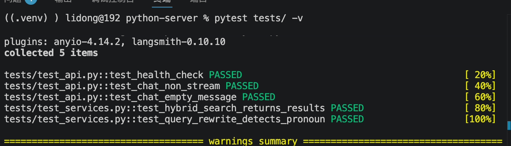

# pytest测试

> 📅 学习日期：2026-07-29
> 🔗 关联面试题：工程化专题 测试相关题目

## 1. 定义

pytest 是 Python 生态中最流行的测试框架。它的核心作用是：用最简洁的代码，自动化的验证程序（函数、接口、Agent 逻辑）是否按照预期工作。

### 1.1 为什么需要pytest

- 项目功能越来越多，手动 curl 测试覆盖不全
- 测试用例是“安全网”——改完代码跑一遍，确认没有破坏已有功能
- AI 应用的非确定性输出不能按传统方式断言，需要针对性设计测试策略


## 测试分类

| 测试类型 | 数量 | 测试内容 |
|---------|:---:|------|
| 接口测试 | 3 个 | `/api/health`、`/api/chat`（正常返回）、`/api/chat`（空消息） |
| 服务层测试 | 2 个 | `hybrid_search` 返回非空、`rewrite_query` 代词消解 |


## 实践

1. 安装 pytest + 配置测试环境

```bash
pip install pytest httpx
```

新建 tests/ 目录和 tests/__init__.py：

```bash
mkdir -p tests
touch tests/__init__.py
```

2. 写3个测试接口

新建 tests/test_api.py：

```python
from fastapi.testclient import TestClient
from app.main import app

client = TestClient(app)


def test_health_check():
    """测试健康检查接口"""
    response = client.get("/api/health")
    assert response.status_code == 200
    data = response.json()
    assert data["status"] == "ok"
    assert "timestamp" in data
    assert "uptime" in data


def test_chat_non_stream():
    """测试非流式聊天接口"""
    response = client.post("/api/chat", json={
        "message": "宝宝发烧怎么办",
        "session_id": "test"
    })
    assert response.status_code == 200
    data = response.json()
    assert "answer" in data
    assert len(data["answer"]) > 0
    assert "references" in data


def test_chat_empty_message():
    """测试空消息应返回错误"""
    response = client.post("/api/chat", json={
        "message": "",
        "session_id": "test"
    })
    # 空消息应该返回 422（Pydantic 校验失败）或其他非 200 状态码
    assert response.status_code != 200
```

**解释每行代码的意义：**

| 代码 | 为什么这样写 |
|------|------|
| `TestClient(app)` | FastAPI 内置测试客户端，无需启动真实服务器即可模拟 HTTP 请求 |
| `assert response.status_code == 200` | 确认接口没有报错 |
| `assert data["status"] == "ok"` | 确认返回内容符合预期 |
| `test_chat_empty_message` | 测边界情况——空消息不应导致崩溃或异常回答 |
| `assert response.status_code != 200` | 空消息应被 Pydantic 校验拦截，返回 422 |


3. 写 2 个服务层测试

新建 tests/test_services.py：

```python
from app.services.rag import hybrid_search
from app.services.query_rewrite import rewrite_query


def test_hybrid_search_returns_results():
    """测试混合检索能返回结果"""
    results = hybrid_search("宝宝发烧怎么办", top_k=3)
    assert len(results) > 0
    assert "doc" in results[0]
    assert "score" in results[0]


def test_query_rewrite_detects_pronoun():
    """测试 Query Rewrite 能检测代词"""
    history = [
        {"role": "user", "content": "宝宝发烧怎么办"},
        {"role": "assistant", "content": "建议物理降温..."}
    ]
    result = rewrite_query("他需要吃药吗", history)
    assert result.was_rewritten
    # 改写后的查询应该包含"宝宝"
    assert "宝宝" in result.rewritten_query
```

**解释每行代码的意义：**

| 代码 | 为什么这样写 |
|------|------|
| `test_hybrid_search_returns_results` | 确认混合检索功能正常，不会返回空列表 |
| `test_query_rewrite_detects_pronoun` | 确认指代消解核心能力——检测代词并替换 |
| `assert len(results) > 0` | 检索结果不应为空 |
| `assert "宝宝" in result.rewritten_query` | 确认"他"被正确消解为"宝宝" |

4. 截图



