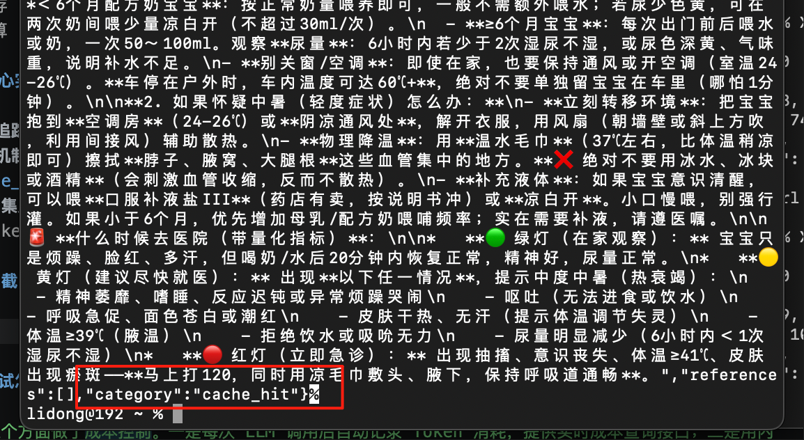
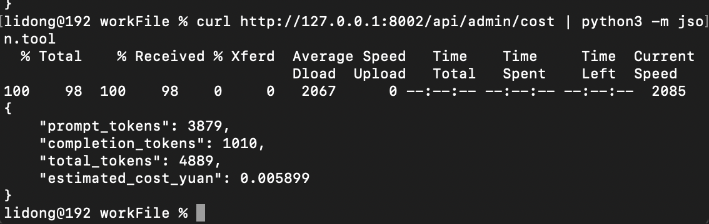

# 成本控制（Token）

> 📅 学习日期：2026-07-30
> 🔗 关联面试题：工程化专题 成本控制相关题目

## 1. 成本构成

| 计费项 | 价格（参考） |
|------|:---:|
| 输入 Token（prompt） | ¥1 / 百万 Token |
| 输出 Token（completion） | ¥2 / 百万 Token |

> 每次请求总费用 = (prompt_tokens × 0.001 + completion_tokens × 0.002) ÷ 1000 元。看起来极便宜，但如果知识库文档很长，每次检索注入大量上下文，Token 消耗迅速增长。缓存高频问题可以直接省掉这部分费用。

## 2. Token 到底烧在哪里了？

在 Agent 系统中，成本主要消耗在 3 个维度：

| 消耗维度 | 具体表现（以 MCP/Agent 为例） | 占比 |
|------|------|:---:|
| Prompt 输入（System + Tools） | 每次请求把 System Prompt + 几十个工具的 inputSchema 塞给模型 | 40%~60% |
| 对话历史（Memory/Context） | ReAct 每步把 Thought→Action→Observation 全部塞回上下文，轮次越多越长 | 30%~50% |
| 模型输出（Completion） | 模型生成的 Thought、Final Answer，以及多 Agent 之间的对话 | 10%~20% |

## 3. 控制方法

### 3.1 压缩输入（Prompt 瘦身术）

这是成本控制的ROI（投入产出比）最高的一步，因为输入的Token 通常比输出的Token要便宜，但量大管饱。

- 精简 System Prompt：不要把系统提示当小作文写。例如，把 500 字的“请你扮演一个专业的助手，注意礼貌，注意格式……”压缩成 50 字的硬性指令。

    - ❌ 冗长版：“你是一个非常智能的 AI 助手，你要尽你所能帮助用户，并且回答问题时要保持礼貌、专业、清晰……”

    - ✅ 精炼版：“专家助手。输出简洁。禁用 Emoji。”

- 按需挂载工具（动态Tool Calling）：这是针对MCP最重要的优化。不要一次性把50个MCP工具（Tools）全部注册给DeepSeek。
    - 做法：先让 LLM 做一次“意图识别”（小型模型），判断用户大概要查“天气”还是“数据库”，然后动态拼接对应的工具 Schema 发给主模型。
- 压缩历史摘要：不要无限堆积历史消息。当对话超过一定轮次之后（比如10轮），用一次LLM调用生成“摘要”替换掉原始的冗长对话记录。

### 3.2 优化流程（架构层刹车）

主要针对ReAct循环和多Agent系统的核心优化：

- 设置硬性“最大步数（Max Steps）”：这是防御死循环的保险丝。如果你的Agent连续跑了5步还没得出结果，代码强制break（中断），并提示”任务过于复杂，请重新描述“。（5 步 Token 消耗是 1 步的 5 倍，必须设限）

- 用”显示路由“替代”LLM路由“：你前面刚学过显式路由。在多 Agent 系统中，让 LLM（大模型）每次去“群聊里选谁发言”极其昂贵。

    - 优化：用代码硬编码 if 任务包含 "数据库" then 路由至 DBAgent，省掉那一次昂贵的 LLM 选择调用。

- 放弃无效的”反思“：Self-Reflection（反思）虽然好用，但是代价是双倍调用。不要每个任务都反思。
    - 策略：只在工具调用报错（Observation 包含 Error）时才触发反思，平时绝不让LLM自己”没事找事“地自我反思。

### 3.3 模型降级与分流（用价格差套利）

DeepSeek 本身很便宜，但如果你接入 GPT-4 或 Claude，价格差明显。不过即使只用 DeepSeek，也有技巧：

- 意图路由（小模型先行）：对于“今天天气怎么样”、“帮我翻译”等简单指令，你完全可以在代码层拦截，不经过完整的 ReAct 循环。或者调用更便宜的 deepseek-v3 处理，只有遇到复杂逻辑才调用更强的 deepseek-r1（带推理链）。

- 缓存高频查询（Redis + 向量库）：如果用户总是问“宝宝喂养建议”这类固定问题，优先查 Redis 缓存或向量库，命中缓存则直接返回结果，0 Token 消耗。

## 4. 实际项目中实现的策略

| 策略 | 实现方式 | 成本节省 |
|------|---------|:---:|
| 用量统计 | 每次 LLM 调用后记录 Token 数 | 提供可视化数据 |
| 高频缓存 | 内存 LRU 缓存，100 条常见问题 | 重复问题零成本 |
| 成本估算 | `/api/admin/cost` 接口实时查询 | 清晰掌握每日花费 |

## 5. 核心实现

- **成本追踪器**：`app/core/cost_tracker.py`
- **缓存机制**：`CostTracker.get_cache()` / `set_cache()`，在`generate_stream_with_interrupt_and_fallback` 中 `get_cache()` 和 `set_cache()`
- **LLM 集成**：在 `call_deepseek` 和 `generate_stream_with_interrupt_and_fallback` 中自动记录 Token

### 5.1 截图

## 6. 面试怎么讲

> “我从三个方面做了成本控制。一是每次 LLM 调用后自动记录 Token 消耗，提供实时成本查询接口；二是用内存 LRU 缓存高频问题，避免重复调用；三是根据数据评估何时需要从 API 切换到本地部署模型。目前 DeepSeek 的 API 价格极低，但养成了成本意识，未来扩展时能立刻知道哪部分开销最大。”

## 7. 项目关联
- 成本追踪：`app/services/cost_tracker.py`
- LLM 集成：`app/services/llm.py`
- Agent 缓存：`app/services/agent.py`
- 查询接口：`app/main.py` → `/api/admin/cost`