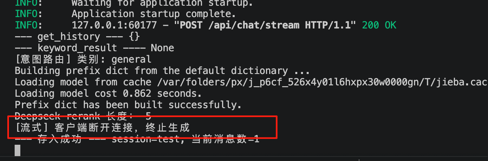
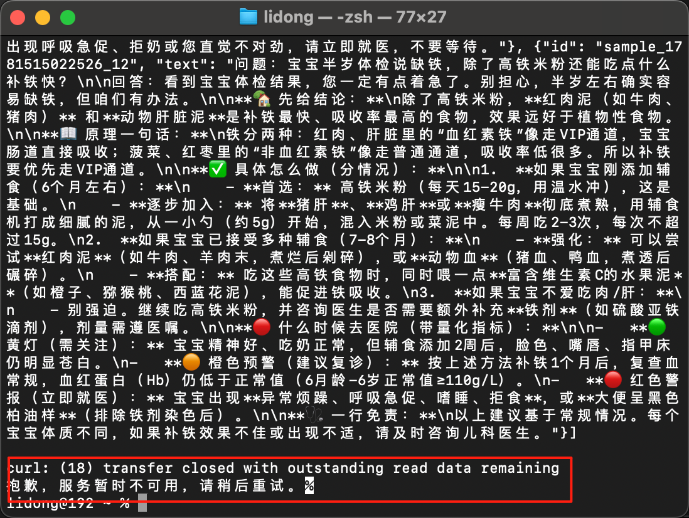

# 流式输出优化

> 📅 学习日期：2026-07-29
> 🔗 关联面试题：流式输出专项 题5、题10

## 1. 中断处理
### 问题
用户点击“停止生成”，前端断开 SSE 连接，但后端还在继续调 LLM 生成 token，浪费算力。

### 解决方案
在流式生成器里检测 `request.is_disconnected()`，如果客户端断开，停止生成并释放资源。

### 核心代码
```python
async def generate_stream_with_interrupt(user_message, request):
    for chunk in stream:
        if await request.is_disconnected():
            break  # 客户端断开，终止生成
        yield delta
    stream.close()  # 释放资源
```

### 截图




## 2. 错误兜底
### 问题
LLM 调用可能遇到 API Key 过期、超时、返回格式错误。没有兜底时，用户看到空白或报错堆栈。

### 解决方案
在流式生成器外层加 try/except，捕获异常后返回已生成内容 + 友好提示。

### 核心代码

```python
async def generate_stream_with_fallback(user_message):
    generated_content = ""
    try:
        for chunk in stream:
            delta = chunk.choices[0].delta.content
            if delta:
                generated_content += delta
                yield delta
    except Exception as e:
        if generated_content:
            yield f"\n\n[生成中断：{str(e)[:100]}，以上为已生成部分]"
        else:
            yield "抱歉，服务暂时不可用，请稍后重试。"
```
### 截图




## 3. 面试怎么讲

> “我做了两层生产级优化。第一层是中断处理——通过检测 request.is_disconnected() 来感知客户端断开，及时终止 LLM 推理并释放资源。第二层是错误兜底——用 try/except 包裹流式生成器，异常时返回已生成的内容和友好提示，而不是让用户看到空白或报错堆栈。”

## 4. 项目关联

- 代码位置：```app/services/llm.py```

- 路由：app/main.py → /api/chat/stream


