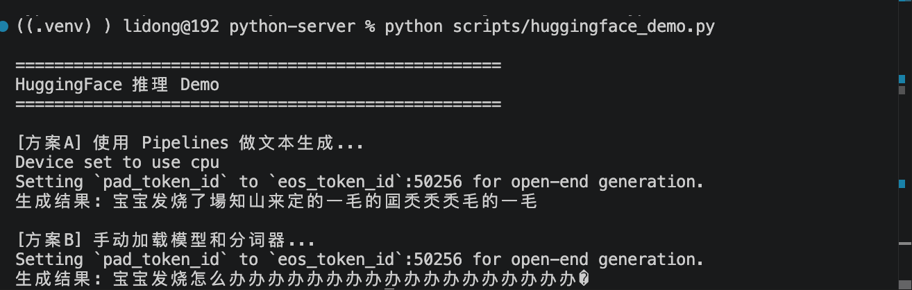

# HuggingFace生态

> 📅 学习日期：2026-08-05
> 🔗 关联面试题：协议与框架专题 开发框架类（HuggingFace 生态相关）

## 1. 定义

HuggingFace 是一个集 AI 开源平台、开发者社区和科技公司于一体的生态枢纽

HuggingFace 是全球最大的开源人工智能（AI）社区与资源平台，被誉为AI界的“GitHub”。

HuggingFace 可以从以下三个层面来理解：

- 一家公司：成立于2016年的美国科技公司，最初做聊天机器人起家，后转型为AI开源平台与基础设施提供商。

- 一个平台与社区：其核心产品 Hugging Face Hub，是一个用于托管和共享AI资源的中央平台，拥有数百万用户，是AI开发者的大本营。

- 一个开源系统：提供了一系列广受欢迎的开源库（如 Transformers），已成为AI领域的行业标准。

## 2. 三大核心组件

1. Hub：AI 资源的“github”：

Hub 是Hugging Face的核心，是一个中央仓库，主要托管：

- 模型（models）：超过200w个预训练模型。

- 数据集（Datasets）：超过150w个数据集。

- 演示应用（Spaces）：用于展示和分享AI应用的交互式Demo。

2. 开源库：强大的开发工具：

Hugging Face 开源了多个关键库，最著名的是：

- Transformer：核心库，提供统一API以加载、训练和使用各种预训练模型。支持NLP、CV、音频等多模态任务。

- Datasets：高效的数据集加载与处理库。这是一个轻量级的数据处理工具库，用于高效地加载、处理和共享数据集。它支持从Hub或本地一行代码加载数据集，并利用 Apache Arrow 格式进行内存映射，使其能够高效处理海量数据。

- Tokenizers：作为连接文本与模型的桥梁，这个库负责将原始文本转换为模型能理解的数组ID。它底层由 Rust 编写，因此速度极快，在CPU上处理1GB的文本通常不到20秒，并提供了训练新词汇表、对齐追踪、自动填充和截断等丰富功能。

- Diffusers：用于图像、音频等生成的扩散模型库。

3. 社区与生态

依托GitHub仓库、论坛和Discord等平台，形成了一个全球性的开发者社区。同时，它与AWS、Google Cloud等主流云厂商深度合作，并拥有AutoNLP、Inference API 等商业化服务


| 组件 | 一句话解释 | 类比 |
|------|------|------|
| Transformers | Python 库，提供加载模型、推理、训练的统一 API | 前端的 axios——统一了调各种 LLM 的方式 |
| Datasets | Python 库，提供加载、处理、共享数据集的标准接口 | 前端的 fetch + 数据处理工具 |
| Model Hub | 模型托管平台，数万个开源模型可供下载使用 | npm registry——搜一下就能找到想要的模型 |


**关键理解：**HuggingFace 的核心价值是标准化——不同的模型（GPT、BERT、T5）结构完全不同，但通过 Transformers 库，你可以用同一套 API 加载和使用它们。这和 MCP 协议标准化工具调用是同一个思想。

## 3. Pipelines

Hugging Face 的 Pipeline 是一个将模型、分词器（Tokenizer）和后处理步骤打包在一起的高级工具。它的核心理念是提供一个开箱即用的“魔法棒”，旨在让使用预训练模型进行推理变得前所未有的简单，无需你处理复杂的底层代码。

核心价值：将复杂的AI资产（模型、分词器、前后处理逻辑）高度封装。即使你完全不懂深度学习的底层原理，也只需要三行代码，就能直接调用各种顶尖的AI能力。

### 3.1 核心原理

Pipeline 的精髓在于其内部自动完成的“三步走”流程：

1. 预处理 (Preprocessing)：这一步由 Tokenizer 完成。它将原始文本（或其他模态的输入）转换为模型能理解的数字（即 input IDs）。这包括将文本拆分为 token、映射为数字 ID，并添加特殊的标记（如 [CLS]）。

2. 模型计算 (Model Forward Pass)：预处理后的数据被送入预训练模型进行计算。

3. 后处理 (Postprocessing)：模型输出的原始数字（如 logits）被转换为人类可读的结果，例如“POSITIVE”和“0.99”这样的标签和分数。

### 3.2 主要优势

- 极简的 API：只需几行代码就能完成复杂的推理任务。

- 任务覆盖广：支持自然语言处理（NLP）、计算机视觉（CV）、音频等多模态的众多任务。

- 自动处理细节：自动选择并加载适用于特定任务的默认模型、对应的分词器或处理器。

- 开箱即用：无需手动编写数据预处理、模型加载和结果解析的代码。

### 3.3 常用功能实例

只需要修改 pipeline() 函数里的第一个参数（即任务类型 Task），就能瞬间切换 AI 的超能力：

1. 情感分析 (Sentiment Analysis)

判断一段文字表达的情绪是积极的还是消极的。

```python
from transformers import pipeline

classifier = pipeline("sentiment-analysis")
print(classifier("这个开源工具真的太好用了，强烈推荐！"))

```

2. 零样本分类 (Zero-Shot Classification)

最神奇的功能之一。你不需要提前训练模型，直接丢给它一段话和几个你临时编的标签，它就能自动对号入座。

```python
classifier = pipeline("zero-shot-classification")
print(classifier(
    "昨晚巴萨在最后三分钟逆转夺冠，全场欢呼！",
    candidate_labels=["教育", "政治", "体育", "娱乐"]
))
# 输出结果会自动把“体育”的得分拉满

```

3. 文本生成/续写（Text Generation）

输入前半句，让 AI 帮你续写接下来的内容（类似简易版的 GPT）。

```python
generator = pipeline("text-generation", model="gpt2") # 也可以换成其他更强的开源模型
print(generator("In a hole in the ground there lived a", max_length=30))

```

4. 命名实体识别（NER）

自动从文章里抓取人名、地名、组织机构名等关键实体。

```python
ner = pipeline("ner", grouped_entities=True)
print(ner("马斯克在旧金山创立了 OpenAI，但后来他退出了。"))
# 会精准提取出：马斯克(人名)、旧金山(地名)、OpenAI(组织名)

```

**和你的项目对比：**

| Pipelines | 你的代码 |
|------|------|
| `pipeline("text-generation")` | `call_deepseek(prompt)` |
| `pipeline("question-answering")` | `hybrid_search(query)` → `call_deepseek(prompt)` |


## 4. 实操 Demo


### 4.1 关键代码

```python
from transformers import pipeline, AutoModelForCausalLM, AutoTokenizer

print("=" * 50)
print("HuggingFace 推理 Demo")
print("=" * 50)

# 方案 A：用 Pipelines（最简单，一行搞定）
print("\n[方案A] 使用 Pipelines 做文本生成...")
generator = pipeline(
    "text-generation",
    model="uer/gpt2-chinese-cluecorpussmall",
    max_length=50
)
result = generator("宝宝发烧了")
print(f"生成结果: {result[0]['generated_text']}")

# 方案 B：手动加载模型和分词器（更灵活，和你的项目最接近）
print("\n[方案B] 手动加载模型和分词器...")
model_name = "uer/gpt2-chinese-cluecorpussmall"
tokenizer = AutoTokenizer.from_pretrained(model_name)
model = AutoModelForCausalLM.from_pretrained(model_name)

# 手动完成 encode → 推理 → decode 的全流程
inputs = tokenizer("宝宝发烧怎么办", return_tensors="pt")
outputs = model.generate(**inputs, max_length=50)
result_text = tokenizer.decode(outputs[0], skip_special_tokens=True)
print(f"生成结果: {result_text}")
```

**代码解释：**

| HuggingFace 代码 | 对应你项目里的操作 |
|------|------|
| `AutoTokenizer.from_pretrained()` | 不需要——你调的是 API，不需要自己分词 |
| `AutoModelForCausalLM.from_pretrained()` | `deepseek_client` |
| `tokenizer(text, return_tensors="pt")` | 你发送给 API 的 `messages` 参数 |
| `model.generate(**inputs)` | `call_deepseek(prompt)` |
| `tokenizer.decode(outputs[0])` | `response.choices[0].message.content` |

> 关键理解：你项目里是调 API——文本发给 DeepSeek 服务器，服务器内部完成分词→推理→解码。HuggingFace 的 Transformers 库是本地推理——模型下载到本地，自己完成全流程。前者省事但有网络延迟，后者可控但需要显卡。

### 4.2 运行结果



> 注：distilgpt2 是 Intel Mac 上唯一能跑的。要跑中文模型需要 Apple Silicon（M1/M2/M3）或者 Linux 服务器——torch >= 2.6 才能加载中文模型的 .bin 权重。

---

## 5. 面试怎么讲

> "HuggingFace 是 AI 界的 GitHub——三个层面理解：开源平台托管了 200万+ 模型和 150万+ 数据集，Transformers 库用统一 API 屏蔽了不同模型的底层差异，Pipelines 把模型推理简化到三行代码。
>
> 它的核心价值和 MCP 协议一样——标准化。不同模型结构完全不同，但通过 Transformers 库，你可以用同一套 `from_pretrained()` → `tokenizer()` → `model.generate()` → `tokenizer.decode()` 流程加载和使用它们。
>
> 我项目里选择调 API 而非本地推理——DeepSeek 的 API 已经足够快、足够便宜，不需要自己维护 GPU。但 HuggingFace 的生态思想我每天都在用——我的 bge-m3 Embedding 模型就是从 HuggingFace 下载的，BGE Reranker 也是。"

## 6. 项目关联

- bge-m3 Embedding 模型来源：HuggingFace `BAAI/bge-m3`
- BGE Reranker v2-m3 来源：HuggingFace
- 推理方式：调 API（DeepSeek）+ 本地部署（Ollama），未使用 Transformers 本地推理
- Demo 代码：`scripts/huggingface_demo.py`

**关键词**：HuggingFace、Transformers、Pipelines、Model Hub、Tokenizer、本地推理 vs API


## 7. HuggingFace Pipelines 的优势和局限性

Pipelines 的优势是极低的使用门槛——一行代码就能完成情感分析、文本生成、问答等任务，适合快速原型验证。局限性也很明显：灵活性受限，无法精细控制检索策略、降级逻辑和自定义评估体系——这些正是我项目需要自建的原因。

我项目中选择了直接调 DeepSeek API 而不是用 HuggingFace Pipelines，因为：①需要自定义混合检索和 Rerank 精排 ②需要三级降级策略保证高可用 ③需要流式输出和中断处理。但 HuggingFace 的 Model Hub 和 Transformers 库对我的价值是——当后续需要本地部署模型（如 vLLM 部署 bge-m3）时，可以用同一套 API 加载和管理模型。

**关键词**：HuggingFace、Pipelines、Transformers、Model Hub、API vs 本地推理