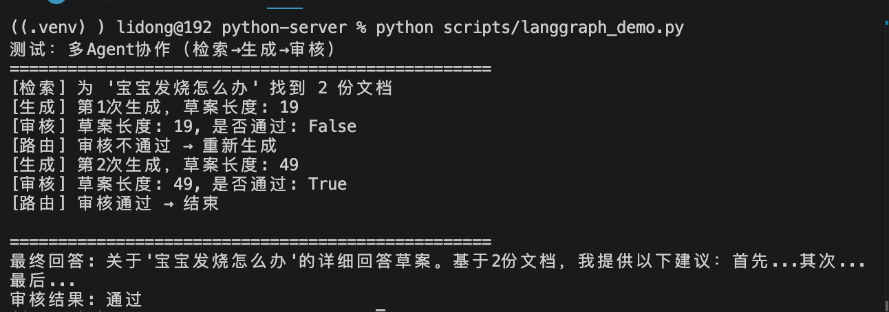

# LangGraph核心概念

> 📅 学习日期：2026-08-03
> 🔗 关联面试题：框架专题「LangChain 与 LangGraph 的差异」

LangGraph 是一个低级别的编排框架和运行时环境，用于构建、管理和部署长时间运行、有状态的AI智能体。

## 1. 为什么需要LangGraph？

LangGraph 是 LangChain 生态中的**状态图编排框架**。它解决的核心问题是：当你需要多个 Agent 协作、或者流程中有分支和循环时，如何清晰地管理状态和执行顺序。

**用你已经熟悉的类比**：

| 你熟悉的 | LangGraph 里的对应 |
|---------|-----------------|
| 前端的 Redux / useReducer | **State（状态）**：全局共享的数据对象 |
| React 组件 | **Node（节点）**：执行具体任务的函数 |
| React Router 路由判断 | **Conditional Edge（条件边）**：根据上一步结果决定下一步去哪 |
| 你的 `unified_agent` 函数 | **StateGraph**：定义整个流程的状态和节点编排 |

**关键理解**：你之前写的 `multi_agent_pipeline` 是一条**写死的流水线**（检索→生成→审核），顺序不能变。LangGraph 的强大之处在于——节点之间的跳转可以**根据条件动态决定**。

---

## 2. LangGraph的核心概念

LangGraph的核心是”图“，它由三个基本要素构成：

1. **状态（State）**：一个所有节点间共享的全局对象，是整个工作流的”记忆库“，每个节点在执行时都可以读取和更新这个状态，从而实现数据在步骤间的传递和持久化。

2. **节点（Nodes）**：图中的”工作单元“。每个节点通常是一个函数或一个LLM调用，负责执行一个特定任务，比如调用一个工具、向模型发送一次请求或处理一段数据。

3. **边（Edges）**：连接节点的”路径“，定义了工作流的控制流，。当一个节点完成工作后，它会沿着一条或多条边将消息传递给下一个节点，。边可以是确定性的（无条件走向下一个节点），也可以是条件性的（根据当前状态动态决定下一步走向哪个节点）。

| 概念 | 一句话解释 | 你的项目对应 |
|------|------|------|
| **State（状态）** | 全局共享的字典，所有节点都能读写 | `unified_agent` 里逐步传递的变量（user_message, docs, answer） |
| **Node（节点）** | 一个 Python 函数，接收 State，返回更新后的 State | `retrieval_agent`, `generation_agent`, `review_agent` 三个函数 |
| **Edge（边）** | 决定节点之间的跳转逻辑 | 写死的顺序调用：`docs = retrieval_agent(); answer = generation_agent(docs)` |

**LangGraph 的 | 管道符 vs 你的顺序调用：**

```python
# 你的写法：写死的顺序调用
docs = retrieval_agent(query)
answer = generation_agent(query, docs)
final = review_agent(query, answer)

# LangGraph 的写法：定义节点和边，框架自动执行
graph.add_node("retrieval", retrieval_node)
graph.add_node("generation", generation_node)
graph.add_edge("retrieval", "generation")  # 检索完必定去生成
graph.add_edge("generation", "review")     # 生成完必定去审核
```

两种写法效果一样。但 LangGraph 额外支持条件边——你可以写一个判断函数，根据 State 的内容决定下一步跳去哪：

```python
# 条件边：如果审核不通过，跳回去重新生成
def should_revise(state):
    if state["review_passed"]:
        return "end"         # 审核通过，结束
    return "generation"      # 审核不通过，重新生成

graph.add_conditional_edges("review", should_revise, {
    "generation": "generation",
    "end": END
})
```
这就是你之前讨论过的“反思-重写”循环的框架化实现。

## 3. 四个核心API

| API | 一句话解释 |
|------|------|
| `StateGraph` | 定义整个流程的全局数据结构和编排规则 |
| `add_node` | 注册一个执行函数，告诉框架”这里有个节点可以干活” |
| `add_edge` | 写死 A→B 的跳转，和你手动顺序调用一样 |
| `add_conditional_edges` | 根据 State 动态决定 A→B 还是 A→C，自建流水线做不到 |
| `compile()` | 验证并编译成可执行的 App |
| `invoke()` | 传入初始数据，自动执行所有节点，返回最终结果 |

**和你自建的对比：**

| LangGraph | 你的 `multi_agent_pipeline` |
|------|------|
| `AgentState(TypedDict)` | 函数里一步一步传递的局部变量 |
| `graph.add_node("retrieval", retrieval_node)` | `def retrieval_agent(query): ...` |
| `graph.add_edge("retrieval", "generation")` | `docs = retrieval_agent(); answer = generation_agent(docs)` |
| `graph.add_conditional_edges(...)` | 需要手动写 `while` 循环控制 |
| `app = graph.compile()` | `def multi_agent_pipeline():` |
| `app.invoke({"query": "..."})` | `multi_agent_pipeline("...")` |

## 4. LangGraph 和 LangChain的关系

两者并非替代关系，而是互补的。它们是同一系统下的不同抽象层级：

- LangChain：是一个高级框架，提供了更便捷的抽象，让你能用最少得代码快速构建出标准的智能体。从LangChain V1.0开始，其核心的`creat_agent`方法就是构建在LangGraph运行时之上的。类似”自动驾驶模式“，适合快速上手和标准场景。

- LangGraph：是一个低级框架和运行时。它不提供太多开箱即用的抽象，而是给你提供最底层的控制权。可以把它看成”手动驾驶模式“，能够精细地控制工作流的每一个步骤，适合高度定制化和可靠性的生产级应用。

## 5. 核心特性

- 持久化执行（Durable Execution）：工作流的状态可以被持久化存储，这意味着即使服务器崩溃或应用重启，智能体也能从上次中断的地方恢复，而不是从头开始。这对于需要长时间运行的任务至关重要。

- 人机协作（Human-in-the-loop）：允许你在工作流的任意节点设置“断点”，在执行前暂停并等待人工审核或输入。这为安全审批或人工决策的关键流程提供了保障。

- 全面记忆（Memory）：支持智能体具有跨会话的长期记忆和单次会话内的短期工作记忆。这使得智能体能够记住历史交互，实现更连贯、更个性化的对话。

- 流式传输（Streaming）：支持逐步输出结果，可以实时地向用户展示思考过程和中间结果，提升交互体验。

- 原生支持复杂逻辑：通过图结构，可以轻松实现循环、分支、并行等复杂控制流，完美适配ReAct这类需要多轮迭代的模式。


## 6. 实操 Demo

### 6.1 流程
检索 → 生成 → 审核 → {审核通过 → 结束 | 审核不通过 → 重新生成}


### 6.2 关键代码

```python
# scripts/langgraph_demo.py

from typing import TypedDict
from langgraph.graph import StateGraph, END

# ==================== 1. 定义全局状态 ====================
class AgentState(TypedDict):
    query: str
    retrieved_docs: list[str]
    draft: str
    final_answer: str
    review_passed: bool
    retry_count: int  # 重试计数器，防止无限循环

# ==================== 2. 定义三个节点函数 ====================

def retrieval_node(state: AgentState) -> dict:
    """检索 Agent：从知识库中检索相关文档"""
    # 模拟检索（实际应调用你的 hybrid_search）
    query = state["query"]
    docs = [
        f"【文档1】关于'{query}'的育儿指南第一部分...",
        f"【文档2】关于'{query}'的育儿指南第二部分..."
    ]
    print(f"[检索] 为 '{query}' 找到 {len(docs)} 份文档")
    return {"retrieved_docs": docs}

def generation_node(state: AgentState) -> dict:
    """生成 Agent：基于检索结果生成初步回答"""
    query = state["query"]
    docs = state["retrieved_docs"]
    retry = state.get("retry_count", 0)

    # 模拟生成（第一次生成较短，触发重试；第二次生成更长）
    if retry == 0:
        draft = f"关于'{query}'的简短回答草案。"
    else:
        draft = f"关于'{query}'的详细回答草案。基于{len(docs)}份文档，我提供以下建议：首先...其次...最后..."

    print(f"[生成] 第{retry + 1}次生成，草案长度: {len(draft)}")
    return {"draft": draft, "retry_count": retry + 1}

def review_node(state: AgentState) -> dict:
    """审核 Agent：检查回答是否合格"""
    draft = state["draft"]
    retry = state.get("retry_count", 0)

    # 模拟审核：草案长度超过 30 字算通过
    passed = len(draft) > 30
    print(f"[审核] 草案长度: {len(draft)}, 是否通过: {passed}")

    if passed:
        return {"final_answer": draft, "review_passed": True}
    else:
        return {"final_answer": f"审核未通过(第{retry+1}次)，草案过短", "review_passed": False}

# ==================== 3. 条件边：决定审核后去哪 ====================

def should_continue(state: AgentState) -> str:
    """判断审核后是否继续循环"""
    if state["review_passed"]:
        print("[路由] 审核通过 → 结束")
        return "end"

    # 最多重试 2 次
    if state.get("retry_count", 0) >= 2:
        print("[路由] 重试次数用尽 → 强制结束")
        return "end"

    print("[路由] 审核不通过 → 重新生成")
    return "generation"

# ==================== 4. 构建状态图 ====================

def build_graph():
    graph = StateGraph(AgentState)

    # 添加节点
    graph.add_node("retrieval", retrieval_node)
    graph.add_node("generation", generation_node)
    graph.add_node("review", review_node)

    # 设置入口
    graph.set_entry_point("retrieval")

    # 固定边
    graph.add_edge("retrieval", "generation")
    graph.add_edge("generation", "review")

    # 条件边：审核 → 继续生成 或 结束
    graph.add_conditional_edges("review", should_continue, {
        "generation": "generation",
        "end": END
    })

    return graph.compile()

# ==================== 5. 运行 ====================

if __name__ == "__main__":
    app = build_graph()

    print("=" * 50)
    print("测试：多Agent协作（检索→生成→审核）")
    print("=" * 50)

    result = app.invoke({
        "query": "宝宝发烧怎么办",
        "retry_count": 0
    })

    print("\n" + "=" * 50)
    print(f"最终回答: {result['final_answer']}")
    print(f"审核结果: {'通过' if result['review_passed'] else '不通过'}")
```

### 6.3 运行结果


### 6.4 和自建流水线的对比

| 对比维度 | 自建 `multi_agent_pipeline` | LangGraph |
|------|------|------|
| 循环能力 | 需手动写 `while` 循环 | 声明式条件边，框架自动循环 |
| 状态管理 | 函数参数层层传递 | 全局 State，所有节点共享 |
| 可读性 | 代码顺序清晰，但循环逻辑分散 | 节点和边定义集中，意图明确 |
| 灵活性 | 完全控制每个细节 | 受框架约束，但减少样板代码 |
| 调试 | 手动加 `print` 跟踪 | 框架提供执行轨迹 |
| 适用场景 | 简单线性流水线 | 复杂分支、循环、条件跳转 |


## 7. 条件边的价值
- 实现了“审核不通过→重新生成”的自动循环
- 和我的 ReAct 循环思想一致——每步观察结果，决定下一步
- 省去了手动写 while 循环和计数器逻辑

## 8. 面试怎么讲

> “LangChain 解决的是‘怎么调用 LLM、怎么管理 Prompt、怎么串联步骤’的问题，核心是 Chain——一个固定的线性流程。LangGraph 解决的是‘当流程不再线性时，怎么管理状态和分支’的问题，核心是 StateGraph——节点之间可以根据条件动态跳转。

> 我的多Agent流水线目前是线性编排的（检索→生成→审核），这是典型的 Chain 模式。但我讨论过‘审核不通过→重新生成’的循环场景，这就是 LangGraph 的用武之地——用条件边实现动态跳转。本质上，Chain 是 Graph 的特例——只有一条直路的图。”

## 9. 项目关联

- 自建流水线：app/services/agent.py → multi_agent_pipeline

- LangGraph Demo：scripts/langgraph_demo.py

- 条件边对应讨论：审核不通过 → 重新生成（之前讨论过但未实现）

